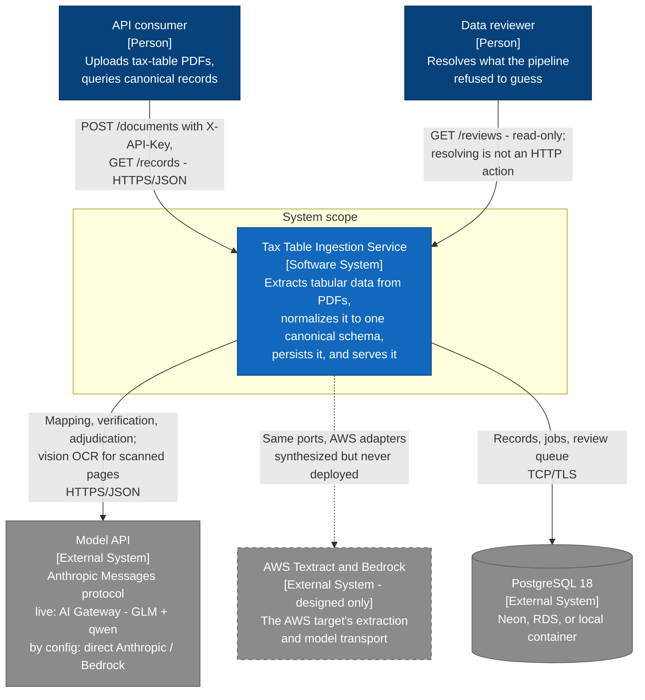
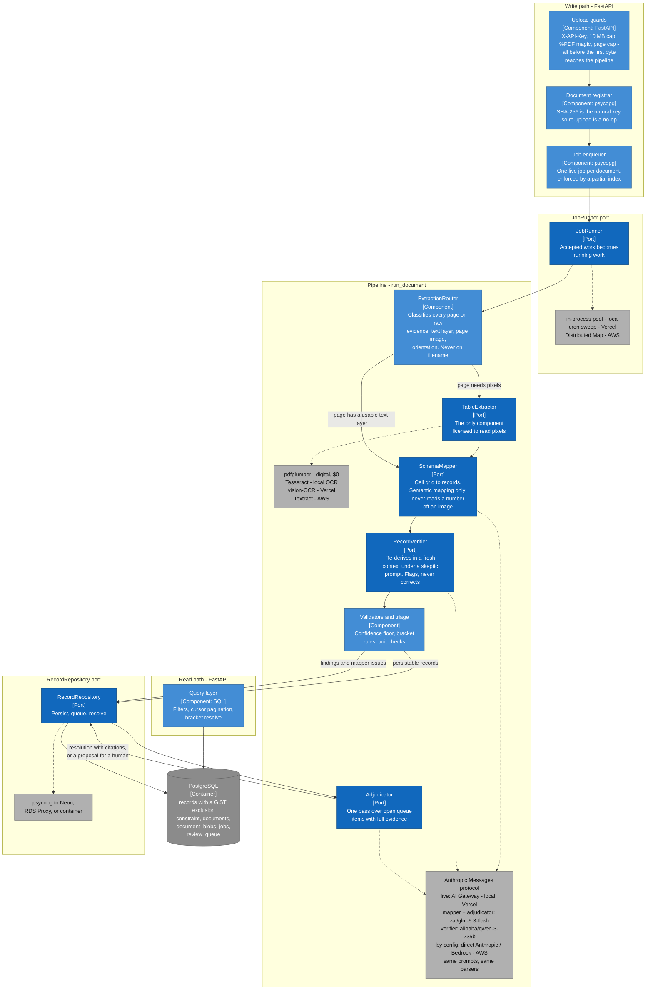

# Tax Table Ingestion Service

Accepts PDF documents containing tax tables, extracts the tabular data,
normalizes it into a canonical schema, persists it in PostgreSQL, and exposes
it over a REST API.

The claim this repository is organized around: **one domain, three deployment
targets, proven rather than asserted.** The same pipeline runs under
`docker compose`, on Vercel, and in an AWS CDK stack, because every boundary
that touches a platform is a port with three adapters behind it.

> **Status at time of writing (2026-08-26).** One thing blocks everything that
> is still open: **there is no funded model API key.** Consequently the
> **Phase 2b accuracy run** has never executed, and while a **Vercel preview
> deployment serves every endpoint** (with cold start and body cap measured
> against it), no document has been extracted or mapped on it — so there is no
> data-bearing live URL and nothing has been promoted to production. Every
> number that depends on that key appears below as an explicit `TBD` with the
> command that fills it. Nothing here is estimated and then presented as
> measured; where something *was* measured, the raw figures are given.

---

## Table of contents

- [The four evaluation criteria, and where each is answered](#the-four-evaluation-criteria-and-where-each-is-answered)
- [Quick start](#quick-start)
- [Architecture](#architecture)
  - [C4 Level 1 — System context](#c4-level-1--system-context)
  - [C4 Level 3 — Components](#c4-level-3--components)
  - [Ports and adapters](#ports-and-adapters)
  - [The extraction router](#the-extraction-router)
  - [The semantic layer](#the-semantic-layer)
  - [The data model](#the-data-model)
- [API surface](#api-surface)
- [Accuracy](#accuracy)
- [Defense in depth, demonstrated](#defense-in-depth-demonstrated)
- [Cost](#cost)
- [Parallel processing and bottlenecks](#parallel-processing-and-bottlenecks)
- [Fixture design](#fixture-design)
- [The three deployment targets](#the-three-deployment-targets)
- [Honest limitations](#honest-limitations)
- [Development log, decisions, and how AI was used](#development-log-decisions-and-how-ai-was-used)

---

## The four evaluation criteria, and where each is answered

| Criterion | Where |
|---|---|
| Clear backend and API design | [Architecture](#architecture), [API surface](#api-surface), [The data model](#the-data-model) — one canonical fact table, a database that makes overlapping brackets *unrepresentable*, cursor pagination, `202`-then-poll ingest |
| Practical approach to PDF extraction and normalization | [The extraction router](#the-extraction-router) and [The semantic layer](#the-semantic-layer) — deterministic first, models only where the task is judgment, and a review queue instead of a guess |
| Reasoning about parallel processing and bottleneck mitigation | [Parallel processing and bottlenecks](#parallel-processing-and-bottlenecks) — what breaks first at 10,000 documents/day, with the arithmetic and the knobs, on both live targets |
| Documentation of development steps and tool choices | [`docs/dev-log.md`](docs/dev-log.md), [`docs/decisions/`](docs/decisions/), and [`docs/audit/`](docs/audit/) — including an honest account of how AI assistance was used |

---

## Quick start

```bash
cp .env.example .env          # fill DATABASE_URL, API_KEY, CRON_SECRET
docker compose up -d --wait db
uv sync
uv run python -m tax_tables.migrate
make api                      # http://localhost:8000/docs
```

Run everything the project can verify without credentials:

```bash
make check       # ruff + mypy --strict + pytest (540 passed, 1 skipped)
make synth-check # cdk synth with NO AWS credentials, then cfn-lint
make diagrams    # every README mermaid block, under two Mermaid majors
```

`make accuracy` runs the end-to-end accuracy gate; it needs a funded
`ANTHROPIC_API_KEY` and is the one skipped test above.

---

## Architecture

### C4 Level 1 — System context



Two things in that picture are deliberately uncomfortable and are stated
rather than hidden. The AWS system is dashed because it was **designed and
validated but never deployed**. And the reviewer's arrow is one-way: they can
*read* the queue over HTTP, but resolving an item is a human judgment this API
does not accept — the write half is out of scope by decision, not by omission
(see [Honest limitations](#honest-limitations)).

### C4 Level 3 — Components

Components inside the service, with the ports drawn as boundaries. Every
component below is platform-agnostic; only the adapters named in the dashed
boxes change between targets.



> **Why these are `flowchart`s and not `C4Component`.** Mermaid's C4 syntax is
> a plugin, and GitHub's bundled Mermaid does not include it — C4 blocks render
> as raw text there while rendering perfectly in the Mermaid live editor and in
> `mermaid-cli` ([GitHub community discussion #197898](https://github.com/orgs/community/discussions/197898),
> closed unanswered, 2026-06-03). "It renders locally" therefore proves nothing
> about GitHub. These diagrams apply C4 semantics through subgraph boundaries
> and typed labels instead, and `make diagrams` parses every block under
> Mermaid 10 **and** 11 to bracket whichever version GitHub ships.

### Ports and adapters

The domain and the pipeline do not know that AWS or Vercel exist.

| Port | local (`docker compose`) | Vercel (live target) | AWS (designed, synth-only) |
|---|---|---|---|
| `TableExtractor` | pdfplumber / Tesseract | pdfplumber / vision-OCR | pdfplumber / Textract |
| `SchemaMapper` | AI Gateway · `zai/glm-5.3-flash` | AI Gateway · `zai/glm-5.3-flash` | Bedrock |
| `RecordVerifier` | AI Gateway · `alibaba/qwen-3-235b` | AI Gateway · `alibaba/qwen-3-235b` | Bedrock |
| `Adjudicator` | AI Gateway · inherits the mapper | AI Gateway · inherits the mapper | Bedrock |
| `JobRunner` | in-process worker pool | cron sweep | Step Functions Distributed Map |
| `RecordRepository` | psycopg → container | psycopg → Neon pooled | psycopg → RDS Proxy |
| `BlobStore` | filesystem | Postgres `bytea` | S3 |

All three semantic roles speak the **Anthropic Messages protocol**; which
endpoint answers it is configuration. The live and local route is the **Vercel
AI Gateway** (`ai-gateway.vercel.sh`), serving `zai/glm-5.3-flash` to the
mapper and adjudicator and `alibaba/qwen-3-235b` to the verifier. **Direct
Anthropic** (`api.anthropic.com`) and **Bedrock** (AWS, designed-only) are the
other two config-selected routes: both are wired and neither is funded here —
no direct-Anthropic key is provisioned on this project, and every measured run
in this README went through the gateway.

The Bedrock adapters are the cheapest possible proof that the seam is real:
they inject `AnthropicBedrock` into the *same three adapter classes*. Zero
duplicated prompts, schemas, parsers, or cost arithmetic — and a test
AST-parses the CDK stack so that a model-id drift between infrastructure and
application fails loudly.

### The extraction router

**Four of the five documents have a text layer.** Running a paid
table-extraction service on them is waste: `pdfplumber` reads the PDF's actual
table structure with higher fidelity than any model inferring it from pixels,
at zero cost, reproducibly.

```
page has a usable text layer  ->  deterministic extraction (pdfplumber). $0.
page is a scan or sideways    ->  the target's OCR adapter
page is genuinely blank       ->  nothing extracted, nothing spent
```

Classification is per page and on raw evidence — deduplicated upright
character count, presence of a page-sized image, text orientation — never on
the filename or document metadata. Two invariants are pinned by tests, one in
each direction:

- a page with a usable text layer is **never** sent to an OCR adapter (OCR
  costs money on two of three targets);
- a page dominated by a page-sized image is **never** handed to the
  deterministic adapter, even when it also carries a small text layer. A
  scanner stamp of 60 characters would otherwise classify a whole scanned page
  as digital, `pdfplumber` would find no tables, and the document would come
  back *empty at confidence 1.0*. That is anti-goal #8's silent loss, and it
  was found by adversarial review and reproduced with a stamped-scan probe.

### The semantic layer

Three model roles, each single-pass, each justified against Anthropic's
published criteria for adding agents ([ADR 012](docs/decisions/012-runtime-multi-agent-semantic-layer.md)):

- **`SchemaMapper`** receives an already-extracted cell grid and decides what
  each cell *means* — which column is a rate, which is a bound, which filing
  status a column belongs to, whether a dash means null. It never reads a
  number off an image and never invents a value.
- **`RecordVerifier`** re-derives the same records in its own context window,
  under a skeptic prompt, with no access to the mapper's reasoning. Context
  isolation is the whole point: two independent derivations that agree is
  evidence; a model agreeing with its own transcript is an echo. A dispute is
  a **flag, never a correction** — the record persists as `needs_review` and
  the dispute reaches the queue with its reason.
- **`Adjudicator`** makes one pass over open queue items. Above a confidence
  threshold, with citations validated against the extracted document, the item
  auto-resolves with a full audit trail; below it, the proposal is stored and
  the item stays with a human. Auto-resolution applies **only** to items whose
  record actually persisted: a queue row standing for data the fact table
  refused is the only live signal of that loss, and never auto-closes.

All three speak the **Anthropic Messages protocol**, and the endpoint is
configuration — live and local, that is the **Vercel AI Gateway**:
`zai/glm-5.3-flash` for the mapper and adjudicator, `alibaba/qwen-3-235b` for
the verifier, a deliberately different family ([ADR
014](docs/decisions/014-semantic-layer-model-selection.md)). Direct Anthropic
and Bedrock are the other two config-selected routes, wired but unfunded here.

Everything else stays deterministic on purpose. The first published criterion
is to find the simplest thing that works, and for structural extraction that
is not a model. An agent in the router would add nondeterminism, latency, and
per-document token cost with no accuracy left to buy.

### The data model

One canonical fact table: a typed core (provenance, temporal validity,
jurisdiction, a `record_type` discriminator, value slots, confidence, review
status) plus a JSONB tail for type-specific attributes. Not eleven tables —
every new document shape would need a migration. Not one blob — no
constraints, no type safety.

**The centerpiece** is that overlapping brackets are not validated in
application code; they are *unrepresentable*:

```sql
EXCLUDE USING gist (
    jurisdiction  WITH =,
    record_type   WITH =,
    tax_year      WITH =,
    filing_status WITH =,
    taxpayer_class WITH =,
    bracket       WITH &&
) WHERE (bracket IS NOT NULL AND lifecycle_status = 'active')
```

Three facts about the domain that a naive schema gets wrong, each with a test:

- the top bracket is **open-ended** (`and over`) — `int8range` with a null
  upper bound, accepted;
- one local rate in document 03 is **legitimately negative** (a statutory
  rebate) — a `rate >= 0` check would reject valid data;
- a long dash means **no tax imposed** — `NULL`, not zero.

Gap-freeness cannot be an exclusion constraint (it is a cross-row aggregate),
so it lives in a validation step and a diagnostic view.

Idempotency at two levels: SHA-256 of the document bytes is its natural key,
so re-uploading the same PDF is a no-op; and records carry a
`UNIQUE NULLS NOT DISTINCT` natural key.

---

## API surface

`docs/openapi.yaml` is exported from the app and a contract test fails if it
goes stale.

| Method | Path | Auth | Notes |
|---|---|---|---|
| `POST` | `/documents` | `X-API-Key` | **202 + `job_id`.** Never blocks on extraction |
| `GET` | `/jobs/{job_id}` | public | status, counts, error payload |
| `GET` | `/records` | public | `tax_year`, `jurisdiction`, `record_type`, `filing_status`, `effective_on`, `include_superseded`, `min_confidence`; **cursor** pagination |
| `GET` | `/records/resolve` | public | the bracket containing an amount |
| `GET` | `/documents`, `/documents/{id}` | public | provenance |
| `GET` | `/reviews` | public | everything the pipeline refused to guess; filters `status`, `document_id`; **cursor** pagination |
| `GET` | `/reviews/{id}` | public | one item with its adjudication audit trail |
| `POST` | `/internal/sweep` | `CRON_SECRET` bearer | the cron / queue-subscriber path |

`GET /records?tax_year=2026` returns active 2026 records and excludes
superseded ones. That is a test, not a claim.

`GET /records/resolve` returns the applicable bracket **record**. It is a data
lookup, and the response deliberately does not read as a computed tax
liability.

The review surface is **read-only, and the schema pins it that way** — a
contract test asserts that `/reviews` and `/reviews/{id}` expose `get` and
nothing else, so "no write path" survives a future edit that adds a handler
without revisiting the decision.

---

## Accuracy

> **Gate OPEN at 100/128, and the honest headline is that the last change made
> it worse.** Ten of the eleven record types are perfect, four of the five
> documents are perfect, and across **1,250 compared fields not one differs**.
> All 28 failures are one record type, on one document, on one field. Every
> failing record is named below.

| Document | Expected | Correct | Field-diff | Missing | Spurious | Verifier disputes |
|---|---|---|---|---|---|---|
| `01_federal_income_tax_rate_schedules_TY2026.pdf` | 32 | 4 | 0 | 28 | 28 | 1 |
| `02_standard_deduction_schedule_TY2026.pdf` | 8 | **8** | 0 | 0 | 0 | 0 |
| `03_state_local_sales_tax_rates_2026.pdf` | 51 | **51** | 0 | 0 | 0 | 0 |
| `04_employment_tax_rates_and_thresholds_2026.pdf` | 18 | **18** | 0 | 0 | 0 | 0 |
| `05_capital_gains_preferential_rates_TY2025.pdf` | 19 | **19** | 0 | 0 | 0 | 1 |
| **Total** | **128** | **100** | **0** | **28** | **28** | **2** |

**The 28 failures, named.** All document 01, all `ordinary_income_bracket`,
all the same field:

> `US-FED | 2026 | <filing_status> | taxpayer_class` — **expected `individual`,
> got `null`**, across 7 bracket rows x 4 filing statuses. The same document's
> 4 `estate_or_trust` records matched and scored. Every other field on all 28
> is correct; they fail on the natural key alone, which is why `Field-diff` is
> 0 while `Missing` and `Spurious` are 28.

**The cause was a fix, and it is worth being blunt about.** The previous run
scored 119/128 with nine failures in document 04. Reconciling the conventions
repaired all nine — document 04 went 9/18 to **18/18** — and one of the same
edits added an emphatic *"taxpayer_class is null on this record type"* to the
bullet directly below the ordinary-income rule, to protect 12 records from a
risk that never materialised. It generalised: the model nulled the field on
every filing-status row. **A fix for a hypothetical 12-record risk cost 28 real
ones.**

### A prompt is read as a whole — the most transferable thing this project produced

This one is worth lifting out of the run report, because it generalises past
tax tables and past this codebase.

**The provenance, in order.** The reconciliation went under a three-lens
adversarial audit *before* the paid run — contradiction, completeness,
regression — plus an arbitrator that re-verified every quoted line against
the tree. **Two of the three lenses independently named this exact field, on
these exact 28 records, as their top finding.** The arbitrator refuted them,
and its argument was a good one: the `taxpayer_class` rule they were worried
about *had not changed since the run where document 01 scored 32/32*. Text
that is byte-identical to text that passed cannot be the cause of a new
failure. That is sound reasoning, and it was accepted.

It was also wrong, for a reason the arbitration had no way to see from the
text it was quoting: **the diff had changed the text's neighbourhood.** Two
bullets away, a new emphatic clause — *"but by filing status ONLY:
taxpayer_class is null on this record type"* — had been added to the
`preferential_gain_bracket` rule, in a register none of the surrounding
prose used. The model read the section as a whole and generalised the
emphasis to the adjacent `ordinary_income_bracket` rule, nulling
`taxpayer_class` on all 28 filing-status rows.

> **Unchanged text is only stable while its neighbourhood is unchanged.**
> A prompt is not a set of independent clauses that can be diffed one at a
> time. It is a document, read whole, and an adjacent sentence in a stronger
> register is a change to every rule near it — even when their bytes are
> identical.

**The sharpest detail is what the clause was defending.** It was added to
protect 12 `preferential_gain_bracket` records from taking a
`taxpayer_class` they should not have. But the field-level bullet, forty
lines above, already said so **by name**:

> `taxpayer_class` … is set on ORDINARY_INCOME_BRACKET RECORDS ONLY … on
> every other record_type — **including preferential_gain_bracket, which does
> carry a filing_status** — taxpayer_class is null.

That sentence is byte-identical in the 39/128, 119/128 and 100/128 runs, and
`preferential_gain_bracket` scored **12/12 in every one of them**. The
protection was already in place, already explicit, already named, and already
measured. The added clause bought nothing and cost 28 records — the
restatement was not merely redundant, it was the defect. *A second statement
of a rule you have already stated is not free; it is a change in emphasis, and
emphasis is exactly what a model generalises.*

**What we would do differently**, stated as a rule rather than a regret: an
adversarial reviewer that clears a finding on "this text is unchanged" must be
required to check what moved *next to* it. Stability is a property of a
neighbourhood, not of a line.

**Disposition — a bounded regression revert, then one final run.** 100/128 is
the last *measured* result and it is recorded here rather than quietly
replaced. It is not the shipped configuration: the three sentences gate 5
added to two record-shape bullets have been deleted, returning both bullets to
the text that scored 119/128, and a sixth run is pre-registered as final
([ADR 014 §8g](docs/decisions/014-semantic-layer-model-selection.md)). All
three deletions remove *restatements* of rules the closed attribute dictionary
already carries verbatim — no rule was weakened, only emphasis removed. The
sixth run's numbers replace this section whatever they are; there is no
seventh.

### How it got here: five runs, and what each one measured

| | Baseline | Hardened | Gapped | Reconciled-1 | Frozen |
|---|---|---|---|---|---|
| Records delivered | 0 | 128 | 128 | 128 | 128 |
| mapper `item_ok` | 27.1% | 100% | 100% | 100% | 100% |
| verifier `call_ok` | 0% | 100% | 33.3% | 100% | **100%** |
| Records flagged unverified | 128 | 0 | 50 | 0 | **0** |
| Natural keys matching | 0 | 0 | 124 | **128** | 100 |
| Fields compared | 0 | 0 | 1,562 | 1,614 | 1,250 |
| Fields **differing** | — | — | 255 | 11 | **0** |
| **Field-level accuracy** | **0/128** | **0/128** | **39/128** | **119/128** | **100/128** |

Each run moved the failure one layer outward, and **every layer was a defect in
the specification, not in the model** — transport framing, then the identity
vocabulary, then bound semantics and an unnamed attribute tail, then one
unreconciled paragraph, and finally one over-eager sentence in the fix for
that paragraph. The harness drove specification completion in five steps, and
the fifth is the one that shows the method has teeth: it caught a regression
that a three-agent adversarial review had talked itself out of.

> **The closing fact of the progression: across all five runs, no mapped
> value was ever wrong** — and the final run puts that on its firmest footing,
> with **1,250 fields compared and zero differing.** Every failure at every stage was a field the schema
> asked for and did not describe well enough to get — a framing convention, an
> identity vocabulary, a bound semantics, an attribute name, a contradiction
> between two paragraphs, a discriminator nulled by an adjacent sentence. The
> single value error in the entire exercise was document 05's `566751`, which
> no later run reproduced.
>
> That is the honest summary of what an LLM did well here and what it did not.
> It read these documents correctly and consistently. What it could not do was
> guess a specification nobody had written down — and the harness is what
> turned each of those gaps from an opinion into a measurement.

Values were never copied from the oracle. What the conventions adopted from
the target schema are *encodings* — `US-FED`, `estate_or_trust`, the
`attribute_key` slugs, the attribute key names, and the inclusive-bounds
reading of `Over $X` — none of which is printed in any PDF, while every value
beneath them is read from the page. `src/` never opens
`fixtures/ground_truth.json`; the packaging excludes it from the deployed
bundle, and a test enforces both.

### What the independent verifier was actually worth

[ADR 012](docs/decisions/012-runtime-multi-agent-semantic-layer.md) argues
that a second model reviewing its own family's output is an echo, and puts a
*different* family (`alibaba/qwen-3-235b`) on the mapper's
(`zai/glm-5.3-flash`) work in a fresh context under a skeptic prompt — both
through the AI Gateway, one protocol, two vendors. That
argument was theoretical until this run.

**It named five of the failures before the oracle was ever consulted.** Of
nine disputes, five landed on exactly the `additional_medicare` records that
the harness later scored wrong, each with the correct reason — that the
threshold belongs to the cited cell. A model that had never seen the mapper's
reasoning, working only from the same grid, independently re-derived the
records and found the defect. That is cross-family verification doing the one
thing it exists to do, measured rather than asserted.

Reported honestly, it also cried wolf four times. Three disputes object to
`$192.30` being stored as `192.3` — presentation, not value; those records
are correct and the conventions now state that numeric equality is decimal
equality. The fourth reproduces a known misread, claiming a record holds
`257300` when it holds `257250`; it is kept as a documented limitation rather
than papered over. Its cost is one review-queue row on a correct record —
which is a false positive behaving exactly as a review queue is designed to
absorb. The failure worth fearing is the false *negative*, and that is what
the second family buys protection against.

No dispute was settled by the models talking to each other. All nine became
review-queue flags for a human, which is the bound
[ADR 012](docs/decisions/012-runtime-multi-agent-semantic-layer.md) sets.

A per-record-type breakdown prints alongside the table. The **verifier
disagreement** column is deliberately not folded into the accuracy number: it
measures how much friction independent re-derivation produces, which is a
different question from whether the mapper was right.

---

## Defense in depth, demonstrated

Layered safeguards are easy to claim and hard to evidence. This one was
evidenced by accident, on document 05, and it is the single result this
project would most like read closely — because **every semantic layer passed
a record that was wrong, and the database caught it anyway, with no access to
the test oracle.**

The document prints its top rate bands as `Over $566,700`. The schema stores
brackets as inclusive integers, so that band begins at 566,701. Here is what
each layer did with it.

**1 — The conventions steered it wrong.** `CANONICAL_CONVENTIONS` enumerated
the open-*top* forms (`and over`, `or more`, `No limit`) and then said
*"transcribe, never re-derive"*. No rule covered an exclusive *lower* bound.
The specification, not the model, was the defect.

**2 — The model obeyed.** It transcribed `lower_bound: 566700`, exactly as
instructed, at confidence 0.94. Four records, one per filing status.

**3 — The independent verifier was unavailable.** On that document it
returned a body with no verdict envelope, three times. Containment did its
job — the records were flagged `verifier_unavailable` rather than blessed,
because silence is never assent — but the second opinion never arrived.

**4 — The adjudicator endorsed it at 0.95.** With `citations_valid: true`,
citing cell `p1_t0 r3,c4`, and concluding *"the persisted record matches the
page, so no change is needed"*. **The mechanical citation check passed too**,
and correctly: it verifies that the cited cells carry the figures the
resolution asserts, and `Over $566,700` genuinely contains 566700. The figure
was right. The derivation was wrong. No citation check can see that
difference.

**5 — The database refused all four.** An inclusive lower bound of 566,700
collides with the band below, whose upper bound *is* 566,700. The
`EXCLUDE USING gist` constraint rejected every one:

```
bracket_overlap: bracket [566700, and over] overlaps [64751, 566700] in the same chain
```

15 of 19 records persisted, 4 refused, **4 open review-queue rows** — the
no-silent-loss proof (anti-goal #8). The constraint needed to know only that
two intervals in one chain overlapped. It needed no ground truth, no model,
and no network.

**What it cost, and what it bought.** The harness later confirmed all four
against the oracle, so the constraint was right. But the constraint reached
that verdict *first*, and independently — which is the entire argument for
making bracket overlap unrepresentable in the DDL rather than validating it
in application code. Application-level validation would have been written by
the same author, from the same wrong understanding of `Over $X`, and would
have agreed with the mapper.

**And the near miss, which is the sharper half.** Those four records were
absent from the fact table, yet the adjudicator's 0.95 endorsement had
cleared threshold, citations, and mechanical support. It did not auto-close
them for one reason only: the flag happened to be `verifier_unavailable`,
which is default-denied for unrelated reasons. Had it been `confidence_floor`
— a rule this same document also produced — the item would have closed itself
as "verified-correct" over data the database had rejected, because
eligibility keyed on the queue row's *rule name* rather than on whether the
record was actually there. It now keys on presence, asked of the fact table
per item ([ADR 014 §8a-b](docs/decisions/014-semantic-layer-model-selection.md));
the two reachable paths are pinned by tests. Full evidence, including the
adjudicator's verbatim rationale, is in
[`docs/audit/evidence/`](docs/audit/evidence/).

---

## Cost

The headline finding is structural and holds on every target regardless of
what the runs measure:

**Four of five documents cost `$0.00` to extract, on all three targets.** The
router sends them to `pdfplumber`. Document 05 — the scanned one — is the only
document with nonzero extraction cost anywhere.

| Role | local | Vercel | AWS |
|---|---|---|---|
| Extraction, documents 01–04 | `$0.00` | `$0.00` | `$0.00` |
| Extraction, document 05 | Tesseract, `$0.00` (CPU) | vision-OCR, per-token | Textract, `$0.015`/page (list) |
| `SchemaMapper` | per-token | per-token | per-token |
| `RecordVerifier` | per-token | per-token | per-token |
| `Adjudicator` | per open queue item | per open queue item | per open queue item |

The three per-token rows are the **Anthropic Messages protocol** billed at
whichever endpoint configuration selects. Measured here, live and local, that
is the **Vercel AI Gateway**: `zai/glm-5.3-flash` at `$0.075` / `$0.25` per
Mtok for the mapper and adjudicator, `alibaba/qwen-3-235b` at `$0.22` /
`$0.88` for the verifier. Direct Anthropic and Bedrock are the other two
config-selected routes and would bill at their own list prices; neither is
funded here, so no number in this section came from either.

Every price is configuration, not a hardcoded constant, and the accounting is
arithmetic rather than estimation: the extractor counts API calls, and the
model adapters read token usage off the response.

> **TBD — gate open.** Measured USD per document, itemized by role
> (extraction / mapper / verifier / adjudicator), lands here with the accuracy
> run. A clean document costs exactly one extra call for verification; the
> adjudicator's cost is bounded by queue length, not by a constant.

---

## Parallel processing and bottlenecks

The target: **10,000 documents/day.** Assume the realistic shape rather than a
flat average — 60% of volume inside a four-hour window:

```
6,000 documents / 4 h  =  1,500 documents/hour  =  0.42 documents/second
```

Required concurrency is `0.42 × T`, where `T` is the wall-clock seconds of one
document's pipeline. `T` is dominated by two model calls, not by extraction.

> **TBD — gate open.** `T` is measured by the accuracy run's per-document
> wall-clock column. Until then the concurrency figures below are presented as
> the algebra, not as results.

| `T` (seconds/document) | Concurrency needed at peak |
|---|---|
| 15 | ~7 |
| 30 | ~13 |
| 60 | ~25 |
| 120 | ~50 |

### What breaks first, in order

**1 — Model provider rate limits. This is the real ceiling.** Two calls per
document, and document 03's grid is the large one. At 0.42 documents/second
and an order of 25k input tokens per call, the pipeline asks for roughly
`0.42 × 2 × 25,000 ≈ 21,000 tokens/second`, or **~1.26M tokens/minute** —
above the default organization TPM tier on either provider. Mitigations, in
the order they should be reached for: (a) the router already keeps 4 of 5
documents off the model path for *extraction*, so only the semantic layer
scales with volume; (b) `RECORD_VERIFIER_MODEL` deliberately accepts a
different, cheaper model than the mapper — the same config knob that mitigates
correlated same-model errors also halves the expensive-model TPM; (c) batching
adjudication, which is already per-item and independent; (d) a provisioned
throughput commitment on Bedrock. **A rate limit must never become data loss:**
a throttled document fails its job row with a reason and stays re-runnable.

**2 — Fan-out concurrency, and the fact that it is not one number.**
`MAX_CONCURRENT_DOCUMENTS = 8` bounds *one Map Run*, not the account. The
audit's sharpest finding here was that with nothing reserved, a large batch and
the public read path draw from the same Lambda concurrency pool — so a big
ingest makes `GET /records` return 429s, and a burst of reads stalls the
pipeline. Both directions are now fixed by reserved concurrency (8 per pipeline
step, 25 for the API). Raising throughput means raising `MAX_CONCURRENT_DOCUMENTS`
*and* the matching reservations *and* checking (1) first — the fan-out knob is
worthless if the model provider is already the constraint.

**3 — Connection exhaustion under fan-out.** This is the reason RDS Proxy
(AWS) and the pooled Neon endpoint (Vercel) are in the design at all. Postgres
connections are a fixed, small resource; N concurrent documents × the steps
that touch the database is a multiplier that will exhaust `max_connections`
long before CPU. The proxy's pool is now explicitly sized
(`max_connections_percent=90`, `max_idle_connections_percent=50`,
`borrow_timeout=30s`) — it had synthesized *empty*, which meant the stack's
stated mitigation was a claim rather than a setting. Application-side, every
connection is opened and closed per request or per job, which is the
request-scoped model Vercel enforces anyway.

**4 — Step Functions payload quota.** The Distributed Map passes each
document's extracted grid and mapped records between states, against a **256 KB**
per-state payload limit. Document 03 (51 records across 2 pages) is the one
that gets close. The Map Run's aggregate output is already offloaded to S3 via
`ResultWriter`; the **inter-step** payload is not, and offloading it to S3 is a
named open design item, not a solved one. See
[Honest limitations](#honest-limitations).

**5 — Ingest volume.** 10,000 documents/day at up to 10 MB each is up to
100 GB/day of PDFs. This is exactly the threshold at which the
blob-in-Postgres adapter stops being correct and S3 (or Vercel Blob) becomes
the right store — the trade-off is documented in
[ADR 011](docs/decisions/011-blob-in-postgres-vs-vercel-blob.md), including
the volume at which to switch.

**Not bottlenecks, and why:** API Gateway's default 10,000 RPS is three orders
of magnitude above 0.42/s; Standard Workflow state transitions (4,000/s
account-wide) are likewise not binding at 4 states per document; and
extraction is CPU-bound at zero marginal cost for 4 of 5 documents.

### Where batch-level failure is visible

The Distributed Map runs with `tolerated_failure_percentage=100`, and AWS is
precise about what that means: *"If you specify the percentage as 100, the
workflow won't fail even if all child workflow executions fail."* That is
chosen, not conceded — the Map is **transport**, documents are independent, and
one malformed PDF in a batch of 500 must not abort the 499 that are fine.

The setting is therefore never standalone. Because the Map Run's own status is
uninformative by construction, failure is made legible at both grains:

- **per document — the `jobs` table is the source of truth.** Every pipeline
  step catches into a `MarkFailed` step that writes `status='failed'` with the
  reason, and `GET /jobs/{id}` serves it. Without that catch, this setting
  would convert a loud batch abort into a job stuck at `running` forever:
  silent loss, the worst failure mode this product defines. Every handler binds
  `job_id` and `document_id` as Powertools `Logger` keys, so all five steps'
  log lines grep back to one document — which is the question a fan-out
  actually poses.
- **per batch — a metric and an alarm.** The Map Run is *labelled*, so its
  child executions emit `AWS/States ExecutionsFailed` under
  `<state-machine-arn>/PerDocument` — one datapoint per failed document, while
  the parent execution stays green. `DocumentFailures` alarms on it;
  `PipelineFailures` covers the disjoint case where transport itself broke.
  Both notify an encrypted SNS topic.
- **per run — a report.** `ResultWriter` exports every child execution's
  outcome to its own S3 bucket, and the Map Run's item counts
  (Failed / Aborted / Pending / Succeeded) are available from `DescribeMapRun`.

So: the Map never fails, and every failed document does — once in the database
the API serves, once in a metric an operator can be paged on.

---

## Fixture design

**The five PDFs and `fixtures/ground_truth.json` are self-authored.** The
brief supplied no documents. Rather than treat that as a gap, the fixtures are
the test engineering: each document breaks a different naive assumption, and
the ground truth records the traps explicitly.

> All values are **synthetic**. These are not real tax tables and must not be
> used as such.

| File | Shape | What it breaks |
|---|---|---|
| `01_..._TY2026.pdf` | Wide matrix, 7 rate rows × 4 filing-status columns, two-level header with a merged cell | One *visual* row is four *logical* records. Top bracket open-ended (`and over`) |
| `02_..._TY2026.pdf` | Small tables plus prose | Amounts carry no `$`. One rule exists only in a prose sentence. Carries a prior-year column |
| `03_..._2026.pdf` | 51 rows across 2 pages | Repeated header and `(continued)`. Rates carry no `%` — the unit is stated only in body text. A long dash means *no tax imposed* (NULL, not zero). One legitimately negative rate. One derived column |
| `04_..._2026.pdf` | Landscape, four separate tables on one page | Mixed units in one document. `No limit` as a value. Records that are not brackets at all |
| `05_..._TY2025.pdf` | **Scanned image, no text layer** | `pdfplumber` returns nothing. A different range separator (`to`). One rate exists only in a footnote. The document is **superseded** and must not surface in `tax_year=2026` queries |

Two traps are worth stating on their own, because they are the ones that
quietly corrupt a dataset rather than crash a parser:

- **Document 02 carries the ID `TB-2025-14` but applies to tax year 2026.** Tax
  bulletins are issued in November of the preceding year. `tax_year` must be
  read from the effective-date sentence in the body — never inferred from the
  filename or the document ID.
- **Documents 02 and 04 each hold two tax years in one row** (a current and a
  prior column). An extractor that keeps one column silently loses half the
  records, and reports success.

`fixtures/ground_truth.json` is the **test oracle**. No module under `src/`
may read, import, or embed a value from it; the accuracy harness under
`tests/accuracy/` is the only consumer. This is verifiable with `grep`, and
the packaging layer reinforces it — the ground truth is excluded from any
deployed bundle.

---

## The three deployment targets

### 1. AWS — designed in full, **never deployed**

There is no AWS account and no budget. The design is expressed as a Python
CDK v2 stack that proves itself **offline**, on every push:

- `cdk synth` with **no AWS credentials present** (`cdk-nag`'s
  `AwsSolutionsChecks` runs as an aspect, so one unsuppressed error fails the
  synth);
- `cfn-lint` over the synthesized template;
- the synthesized cloud assembly committed under `infra/cdk.out/` as the
  reviewable artifact.

Current gate: synth exit 0 credential-stripped, `cfn-lint` clean, cdk-nag
**58 compliant / 53 suppressed / 0 non-compliant**, every suppression carrying
an individually written justification next to the resource it covers.

This stack has never met a real control plane. Statements about its
deploy-time behaviour come from documentation and adversarial audit, not from
a deployment — and the audit was worth it: synth-plus-lint-plus-nag green was
nowhere near deploy-correct. See [`docs/audit/`](docs/audit/) for the full
75-finding ledger.

### 2. Vercel — the live URL

> **Platform behaviour worth knowing before you deploy:** Vercel assigns a
> project's **first** deployment to **production**, whatever target you asked
> for — `vercel deploy` with no `--prod` still lands in production and takes
> the production alias. Pass `--target=preview` explicitly on an empty
> project. (Hit and recorded during Phase 3.5; see the dev-log.)

> **3.5-structural CLOSED; 3.5-LIVE still open.** The Vercel adapters, the
> vision-OCR extractor, `vercel.json`, and `scripts/seed_remote.sh` are built
> and a **preview deployment serves every endpoint**. What is still open is
> everything that needs a funded model key: no document has been extracted or
> mapped on the platform, so there is **no data-bearing live URL** and no
> production promotion. Measured against the preview:
>
> | Measurement | Result |
> |---|---|
> | **True first click** — cold function **+ Neon resume** from autosuspend | **6.76 s** (server 4.42 s; DNS 2.18 s) |
> | Cold function, database already active | **0.67 s** |
> | Warm requests | **0.37–0.43 s** (median ~0.39 s) |
> | Request-body cap | **~4.5 MB** (4,482,662 B accepted / 4,495,769 B rejected) |
>
> The first two rows are **different measurements and only the first is what an
> evaluator's first click costs.** The 0.67 s figure was taken minutes after a
> seed run, so the function was cold but Neon was still active. The 6.76 s
> figure comes from leaving the deployment completely untouched for 430 s —
> past Neon's 5-minute autosuspend — and then issuing exactly one request to a
> data-path endpoint. Splitting it by `curl`'s timings: 2.18 s client-side DNS
> for a brand-new hostname (variable, and near-zero on the earlier
> fresh-hostname run), 0.16 s TCP+TLS, and **4.42 s server-side** — of which
> roughly 0.5 s is the function and the remaining **~3.9 s is Neon waking up**.
>
> **A prediction this measurement did not confirm.**
> [ADR 004](docs/decisions/004-aurora-serverless-v2-rejected.md) rejected
> Aurora Serverless v2 over its documented ~15 s resume, and the expectation
> going in was that the chosen stack would win by an order of magnitude. It
> does not. First click against first click it is **6.76 s vs ~15 s — about
> 2.2×**; comparing resume to resume it is **~3.9 s vs ~15 s, about 3.8×**.
> Still a decisive win, and it widens to roughly 4.5× against Serverless v2's
> documented 30 s+ after a day of idleness — but "an order of magnitude" was
> the guess and ~2–4× is the measurement. The ADR's conclusion survives; its
> margin was overstated, and both numbers are now measured rather than one
> being argued.
>
> The honest reading is that **this stack has an autosuspend cliff too** — it
> is simply a much smaller one. A first click after idleness costs seconds, not
> milliseconds, on any scale-to-zero database.
>
> Endpoint sweep against the preview: every `GET` returns correctly, unknown
> ids 404, `/records/resolve` 422s without a chain, unauthenticated and
> wrong-key `POST /documents` both 401, and `/internal/sweep` rejects a
> missing or wrong bearer on **both** `GET` and `POST` while accepting the
> cron bearer. All five fixtures upload **202**; each job then reaches the
> honest `missing_credentials` terminal state, which is the credential block
> showing up exactly where it should — in the job row, not as an HTTP error
> on a valid upload.
>
> Two preview-specific notes. **Vercel crons run on production only**, so on a
> preview the sweep is exercised by direct authenticated call. And of the five
> uploads, four were carried to terminal state by the self-kick while one
> stayed `queued` — the kick is best-effort by design (the daemon thread need
> not outlive the response on request-scoped compute) and a direct sweep
> drained it immediately. That is the cron-backstop contract working, observed
> rather than assumed.
>
> The decisions behind these adapters are recorded in ADRs
> [008](docs/decisions/008-vercel-as-the-live-target.md),
> [009](docs/decisions/009-cron-sweep-jobrunner.md),
> [010](docs/decisions/010-vision-ocr-vercel-extractor.md), and
> [011](docs/decisions/011-blob-in-postgres-vs-vercel-blob.md).

### 3. docker-compose — the evaluator's one-command reproduction

`docker compose up -d --wait db` plus `uv run python -m tax_tables.migrate`
brings up Postgres 18 and applies all eight migrations; `make api` serves the
full surface. This is the target the test suite runs against, and it works
from a fresh clone.

---

## Honest limitations

Consolidated, and deliberately specific. If something is unproven, it says so.

### Gates still open

1. **The accuracy gate stands at 100/128, every failing record is named, and
   the previous run scored higher.** Five runs ship as evidence: 0/128
   baseline (transport), 0/128 hardened (identity vocabulary), 39/128 (bound
   semantics and an unnamed attribute tail), 119/128 (one unreconciled
   paragraph), 100/128 (the fix for that paragraph over-generalised). Ten of
   eleven record types and four of five documents are perfect, and **1,250
   fields were compared with zero differing** — no matched record carries a
   wrong value anywhere. All 28 failures are one field on one record type:
   `ordinary_income_bracket.taxpayer_class`, expected `individual`, got
   `null`, on document 01. See [Accuracy](#accuracy) for the naming and the
   cause. It ships at 100/128 under a frozen specification rather than being
   tuned further, and the higher previous score is recorded rather than
   quietly replaced — a spec tuned run-by-run against a scoring harness stops
   being a specification. The escalation route to an enforcing endpoint is
   budget-gated and remains **blocked, not waived**; no escalation trigger
   fires, because the model followed the conventions it was given and the
   conventions were what needed fixing. Full tables in
   [`docs/dev-log.md`](docs/dev-log.md) and
   [ADR 014 §6-8](docs/decisions/014-semantic-layer-model-selection.md).
2. **Four identity fields are encodings, not extractions — and that boundary
   is deliberate.** `jurisdiction` is `US-FED` or `US-<ISO 3166-2 code>`,
   `taxpayer_class` is `individual` or `estate_or_trust`, and `attribute_key`
   draws on a fixed vocabulary. None of those strings is printed in any
   fixture. They are **target-schema encodings**, adopted the same way the
   `RecordType` and `FilingStatus` enums already were, and the test that
   separates them from cheating is extractability: `US-FED` appears in no PDF,
   so it cannot be extracted, only agreed. A per-record *value* — Alabama's
   printed `4.000` — is the opposite case and is never taken from anywhere but
   the page. `src/` never opens `fixtures/ground_truth.json` at runtime; see
   [ADR 014 §8](docs/decisions/014-semantic-layer-model-selection.md).
3. **Conformance measures the contract, never the truth — the harness is the
   truth check.** Document 01 once produced a run with *zero* contract
   failures and two real semantic defects: the verifier disputed a record on a
   false premise (claiming it held `257300` when it held `257250`), and the
   adjudicator auto-resolved that dispute at 0.98 confidence while repeating
   the false premise, having been given the record's true value. Every
   response involved was perfectly schema-conformant, so the conformance table
   showed nothing. Two gates now stand in front of an unattended close —
   dispute-born queue items can never auto-resolve, and any auto-resolution
   must be mechanically supported by the figures in its own cited cells — but
   the general point stands and is worth stating plainly: **a clean
   conformance table is not evidence of correct data.**
4. **Some discriminators are asserted from convention, not read from the
   page.** Document 01 names no jurisdiction anywhere in its text, so
   `jurisdiction: "US"` (and `currency: "USD"` where no sign appears) comes
   from the canonical conventions. Such fields are now declared in a
   `convention_derived` list on the record rather than given a provenance
   citation they cannot support — see
   [ADR 015](docs/decisions/015-convention-derived-discriminators.md).
5. **The vision-OCR adapter has never run against a real model.** It is
   built, and its 26 tests cover every fidelity and fail-closed rule against
   recorded response shapes — but on the platform each job fails at the
   mapper's credential check *before* extraction is reached, so no page has
   been sent to a vision model. What is untested is whether a real model
   obeys the prompt, not whether the adapter handles what comes back.
   Document 05 is extracted today by Tesseract (local) or, in the AWS design,
   Textract.

### The AWS stack

6. **It synthesizes and validates but was never deployed.** No template here
   has met a real control plane.
7. **The Lambda deploy artifact is incomplete by design.** The functions ship
   the real `src/` tree and the handlers are real, unit-tested code — but the
   runtime dependency layer (psycopg, pydantic, anthropic, boto3, mangum,
   aws-lambda-powertools) is a
   deploy-pipeline build step that intentionally does not exist. Likewise the
   `app_ingest` database role the Lambdas IAM-auth into is created by a
   deploy-time migration, not by the stack, and `API_KEY` / `CRON_SECRET` are
   deploy-time provisioning.
8. **Step Functions inter-step payloads are not offloaded.** Each document's
   extracted grid and mapped records ride the 256 KB per-state payload quota.
   The Map Run's *aggregate* output is exported to S3; the inter-step payload
   is not. Document 03 is the one that approaches the limit.
9. **The documented 10 MB upload cap is a per-target number, and only one
   target's real ceiling is known.** The application-level cap
   (`MAX_UPLOAD_BYTES`, default 10 MB) is enforced before a byte reaches the
   pipeline, but each platform imposes its own body limit underneath it, and
   the smaller of the two wins.

   | Target | Real ceiling | Basis |
   |---|---|---|
   | local / `docker compose` | 10 MB | the application cap; nothing smaller underneath |
   | AWS | **~4.4 MB** | API Gateway caps payloads at 10 MB, but a Lambda proxy integration base64-encodes the binary body into a 6 MB synchronous invocation payload — 6 MB ÷ 4/3. Derived, not measured. |
   | Vercel | **~4.5 MB — measured** | Bisected against a live preview: **4,482,662 bytes accepted (202), 4,495,769 bytes rejected (413)**. The rejection is the platform's `FUNCTION_PAYLOAD_TOO_LARGE`, raised at the edge — the request never reaches the function, so the app's own 413 and its JSON `detail` never fire and the client gets an HTML error instead. Note this contradicts the current platform documentation, which states 100 MB request bodies; the historical 4.5 MB is what this project's plan and runtime actually enforce. Quoting the doc would have been wrong. |

   The application cap (`MAX_UPLOAD_BYTES`, 10 MB) is therefore only binding
   on the local target; on both deployed targets a *smaller* platform limit
   fires first, and on neither does the caller receive the app's own message.
   Uploads above a platform ceiling would need a presigned-upload ingest
   path, which is designed-for but not built.
10. **The VPC endpoint policies are account-scoped, not action-scoped.** All
   seven endpoints require `aws:PrincipalAccount` to be this account, which
   closes the cross-account exfiltration path an unrestricted S3 gateway
   endpoint otherwise opens. They deliberately do not enumerate actions: an
   over-tight endpoint policy is a deploy-time failure this project cannot
   test.
11. **Two runtime AWS calls have no endpoint, deliberately.** The VPC has no
   NAT and no internet path, so every runtime AWS API call must traverse a VPC
   endpoint. All 33 enumerated calls resolve to one of the seven endpoints (S3
   gateway; interface: Secrets Manager, Textract, Bedrock runtime, CloudWatch
   Logs, Step Functions, X-Ray) or to a path that never leaves the local host
   (`rds-db:connect` token signing is local SigV4; Lambda credentials arrive
   via the runtime). Two gaps remain, on purpose:

   | Call | Status | Why it is acceptable — and when it stops being |
   |---|---|---|
   | `bedrock:GetInferenceProfile` / profile-routed invocation | no endpoint, not granted | The stack pins foundation-model IDs. Adopting cross-region inference profiles would require both the IAM grant on the profile ARN and routing this VPC cannot express today. |
   | `cloudwatch:PutMetricData` | no endpoint | No code emits custom metrics. Enabling them requires the `monitoring` interface endpoint first. Note this does **not** affect the failure alarms above: those read `AWS/States` metrics the service publishes itself. |

12. **One accepted IAM over-grant, stated rather than hidden.** The Lambda
   execution roles carry `AWSLambdaBasicExecutionRole` and
   `AWSLambdaVPCAccessExecutionRole`, both of which grant on `Resource "*"`.
   The ENI half genuinely cannot be narrowed (the `ec2:Describe*` calls
   support no resource-level permissions). The **logs half could be** — every
   function here has an explicit log group — and narrowing it means replacing
   CDK's default role on six functions. That is recorded as an open hardening
   item, not claimed as done. Separately, the API Gateway account role's
   `AmazonAPIGatewayPushToCloudWatchLogs` grants `logs:GetLogEvents` and
   `logs:FilterLogEvents` on `*` — account-wide log **read**, materially more
   than its name suggests. It is accepted because the role is assumable only
   by `apigateway.amazonaws.com` and it is the policy AWS requires for API
   Gateway CloudWatch logging.

### The service

13. **The review queue is readable over HTTP but not writable, on purpose.**
    `GET /reviews` and `GET /reviews/{id}` expose every queued item with its
    provenance and its full adjudication audit trail — including the
    below-threshold *proposals* the adjudicator stores on items that stay
    open, since a reviewer cannot act on a proposal they cannot see. There is
    **no write path**: resolving or dismissing an item is a human judgment
    with legal weight over tax data, and exposing it would mean designing
    reviewer identity, authorization, and an approval trail — none of which
    this exercise scopes. A human resolves the remainder through the
    database, where the `closed_rows_carry_audit_trail` constraint makes a
    closed item without its `resolved_by` / `resolved_at` unrepresentable
    whichever route closed it. The omission is asserted by a contract test,
    not merely intended.
14. **`GET` endpoints are unauthenticated by design**, being read-only tax
    data. The write path enforces `X-API-Key` with a constant-time compare,
    and per-IP rate limiting is an edge rule (WAF on AWS; a Vercel Firewall
    rule when Phase 3.5 lands), not application code.
15. **The Textract fixture is hand-constructed.** No AWS credentials ever
    existed, so `fixtures/textract/05_response.json` was built from the
    documented `BLOCK` / `CELL` / `RELATIONSHIPS` shape and is labelled as
    such in the JSON itself, in its generator, and in the tests. Its content
    was transcribed from the real scanned fixture via the local OCR; the
    oracle was never opened. Deviations are recorded in the generator
    docstring.
16. **Bedrock structured-output acceptance is unverified.** The Bedrock
    adapters are real and fixture-tested, but whether a live Bedrock runtime
    accepts the exact structured-output request shape is a deploy-time
    verification item. The parsers fail closed, so the failure would be loud.
17. **The mechanical citation check validates figures, not derivations —
    and cannot be made to.** Before an adjudication may auto-close a review
    item, `resolution_is_supported` requires every number the resolution
    asserts to appear in a cited cell, or to be reachable from one by a
    documented transform. That catches an invented figure. It is structurally
    blind to the *right figure reached by the wrong reasoning*: a resolution
    asserting `lower_bound 566700` while citing a cell reading
    `Over $566,700` passes, because the figure is genuinely there. Document
    05 produced exactly that, at 0.95 confidence, on all four of its top
    bands (see [Defense in depth](#defense-in-depth-demonstrated)).

    This is a real limit and the design answers it by placement rather than
    by patching the check. Convention errors of that class are caught one
    layer down, by the bracket-integrity constraint, which compares a
    record against its *neighbours* instead of against its own citation —
    and that is why bracket overlap is a database constraint here and not an
    application-level validator. A citation check reasons about one record
    in isolation and can never see a collision; making it try would be
    scope it cannot carry. The honest statement is that no single layer
    catches everything, which is the reason there is more than one.

---

## Development log, decisions, and how AI was used

- [`docs/dev-log.md`](docs/dev-log.md) — what was tried, what failed, what was
  chosen and rejected, in order.
- [`docs/decisions/`](docs/decisions/) — one ADR per real decision, including
  the rejections (Aurora DSQL, the RDS Data API, Aurora Serverless v2,
  Terraform/CDKTF) with the threshold at which each rejection would flip.
- [`docs/audit/`](docs/audit/) — the complete 75-finding ledger from the Phase 4
  adversarial audit, with every finding's disposition, **including the 23 that
  remain named-but-unverified by design**.

### How AI assistance was used

This is an AI Engineer exercise, so the honest account is signal rather than
something to bury.

The service *itself* uses models in exactly three places, all bounded and all
documented above: the mapper, the independent verifier, and the queue
adjudicator. Extraction, routing, validation, and persistence are
deterministic code, on purpose.

For *building* it, AI assistance was used throughout — for implementation,
and more usefully as an adversarial reviewer. The Phase 4 audit was 23 agents
run over the committed tree: six resource-type auditors, three directed lenses
(suppression justifications, currency of hardcoded facts, isolated-VPC
completeness), then refute-by-default verification of the highest-severity
findings. It produced 75 findings; the 14 verified were all confirmed, none
refuted, and they collapsed to eight distinct defects — every one of which
would have broken a real deployment while `synth` + `cfn-lint` + `cdk-nag`
stayed green.

The discipline that made it worth anything was the verification standard, not
the agent count. Findings were not accepted on an agent's word: the flow-log
defect was proven by decompiling `aws-cdk-lib`'s `vpc-flow-logs.js`, the
missing throttle retry by decompiling `invoke.js`, the security-group egress
defect by decompiling `security-group.ts` *and* quoting the CloudFormation
docs. Three promoted findings were **refuted** on that standard and are
recorded as refuted. And where an agent-named finding was never verified, it
is labelled unverified rather than quietly folded into a fix list.

