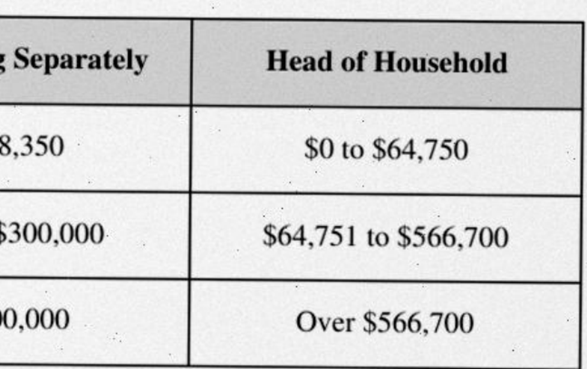

# Development log

Chronological record of what was tried, what failed, and what was chosen — as
required by the brief ("documentation of development steps and tool choices").
This project is built with heavy, deliberate AI assistance (Claude Code); for an
AI Engineer role that is signal, not something to hide. Orchestration choices are
logged here alongside engineering ones.

## 2026-08-25 — Project setup

- **Fixtures committed first.** The brief supplied no documents, so the five
  input PDFs and `ground_truth.json` are self-authored, produced by the committed
  generator scripts (`fixtures/gen_fixtures.py`, `gen_groundtruth.py`,
  `scanify.py`). Each document is designed to break a different naive extraction
  assumption; see CLAUDE.md "The input documents".
- **Environment verified before writing code.** Docker 29.7.2 (local Postgres for
  tests), uv 0.10.10, Node 25, Vercel CLI 59.5.0 linked to project `auxis` with
  the Neon Marketplace integration attached.
- **Finding: Vercel Queues is not available on this account's scope.** The
  dashboard shows no Queues product. Decision: the Vercel `JobRunner` adapter
  will be the cron-sweep fallback anticipated in CLAUDE.md — a jobs-table sweep
  driven by a `vercel.json` cron at minute granularity. The latency trade-off
  will be recorded in the JobRunner ADR at Phase 3.5.
- **Finding: the Neon integration creates its env vars as Sensitive**, so
  `vercel env pull` returns `[SENSITIVE]` placeholders instead of values. Runtime
  functions receive real values; local runs against Neon (the Phase 1 gate) need
  the connection string copied from the Neon console into `.env`.
- **Tool discipline encoded in the repo.** `.claude/settings.json` allowlists the
  dev toolchain (uv, pytest, ruff, mypy, docker, psql, git, curl, node, make),
  forces a prompt on every `vercel` command, and hard-denies
  `vercel deploy --prod` / `promote` / `rollback` and `cdk deploy` / `bootstrap` —
  anti-goals #5 and #9 enforced at the harness level, not just documented.
- **Orchestration plan.** Sequential single-agent work by default. Multi-agent
  fan-out is reserved for the three phases where it genuinely helps: Phase 2
  (one agent per fixture PDF, adversarial verification of extracted records),
  Phase 4 (audit of the synthesized CloudFormation template), Phase 5 (final
  review against the evaluation criteria).

## 2026-08-25 — Phase 0: scaffold

- `uv` project, Python 3.12, src layout (`src/tax_tables/`), hatchling build so
  the package installs editable and imports cleanly from tests.
- ruff (lint + format) with a broadened rule set, mypy `strict = true`, pytest.
  One smoke test so `make check` exercises the whole toolchain on the empty
  project rather than trivially passing with zero tests collected.
- `make check` = lint + typecheck + test; the same entrypoint runs locally and in
  CI (GitHub Actions, `astral-sh/setup-uv` with caching) so the Phase 0 gate is
  one command in both places.
- `.env.example` documents every required variable per anti-goal #10; `.env` is
  gitignored and never enters the repo.
- **Gate result:** `make check` clean locally on the first run, and green in CI
  on the first push (run 32911320432, 16s). Repo: github.com/Rocuts/Auxis.

## 2026-08-25 — Phase 1: DDL, validated against current practice

Before writing the schema, a research agent verified the stack assumptions
against August-2026 documentation. Material corrections it produced:

- **Neon defaults to Postgres 18** for projects created after 2026-06-05, and
  the major version is immutable after creation. The local image is therefore
  pinned to `postgres:18`, not 17; migrations and the gate probes were verified
  against 18.6. To confirm against the real branch once `.env` exists:
  `SHOW server_version`. Caveat for docker-compose: the official `postgres:18`
  image moved `PGDATA` to a version-specific path (`/var/lib/postgresql/18/docker`),
  so 17-era volume mounts silently initialize an empty database.
- **`prepare_threshold=None` is obsolete.** psycopg >= 3.2 supports protocol-level
  prepared statements through PgBouncer >= 1.22 (Neon runs 1.22 with
  `max_prepared_statements=1000`) when bundled libpq >= 17. The repository
  adapter will gate on `psycopg.capabilities.has_send_close_prepared()` instead
  of blanket-disabling prepared statements.
- **`int8range` over `numrange` is a choice, not a necessity.** numrange would
  also support unbounded tops, but int8range's canonicalization (inclusive
  integer bounds normalize to half-open) is what makes adjacency and gap
  detection exact. Bracket bounds in the fixtures are whole-currency integers,
  so the discrete type fits.
- **PG18's `UNIQUE ... WITHOUT OVERLAPS` evaluated and rejected** for the
  polymorphic table: it cannot be partial (`WHERE bracket IS NOT NULL`) and
  forces sentinel values into discriminators the canonical schema keeps NULL.
  The hand-written GiST exclusion constraint with COALESCE stays; rationale
  recorded in `migrations/0003_records.sql`.
- **Migrations must run over the direct (unpooled) endpoint** — Neon lists
  schema migrations first among operations that need it — with
  `pg_advisory_lock` for serialization, generous `connect_timeout` (scale-to-zero
  resume), and `lock_timeout` before DDL.
- Noted for Phase 3: FastAPI 0.132+ enforces strict `Content-Type` on JSON
  bodies by default; Pydantic v2 (2.13.x) is current, v3 does not exist.

DDL verified live before review: all four migrations apply cleanly on
Postgres 18.6, overlap insert rejected by `no_overlapping_brackets`, adjacent +
open-ended top bracket accepted, negative rate accepted, and the NULL
`taxpayer_class` trap (document 05) confirmed closed by the COALESCE chain.

## 2026-08-25 — Phase 1: review findings and implementation

The DDL was human-reviewed line by line and approved with two design
conditions, both now encoded and tested:

- **Cross-document conflict policy.** The natural key deliberately excludes
  `document_id` (cross-document dedup), which means a plain upsert could let
  one document silently overwrite another's value — the neighbor of
  anti-goal #8. The adapter's upsert carries
  `WHERE records.document_id = EXCLUDED.document_id`: same document refreshes
  the row (updated_at moves); a different document is refused, and the incoming
  record goes to the review queue with reason
  `cross_document_natural_key_conflict`. Tested both ways.
- **Supersession rule, stated explicitly:** lifecycle_status is declared by
  document content (document 05 self-declares superseded; the mapper reads it
  from the body) — never inferred from arrival order, and the repository never
  promotes/demotes rows as an insert side effect. Corollary: ingestion is
  commutative, proven by a repository-level test that ingests an active set
  and a superseded set in both orders and asserts identical final state. The
  full five-fixture commutativity test lands with the Phase 2 pipeline.

Minor review fixes: `effective_window` CHECK, `updated_at` audit column,
COALESCE(filing_status) re-commented as deliberate defense-in-depth (only
taxpayer_class strictly needs it), and a note that the exclusion constraint's
GiST index serves `GET /records/resolve` only when queries use the same
COALESCE expressions. Migration homes: btree_gist in 0001, documents/jobs in
0002, records in 0003, review_queue + gap view in 0004.

Implementation: Pydantic v2 canonical model (strict, frozen, shape-validated),
plain-SQL migration runner (direct endpoint, advisory lock, per-file
transaction, `-- migrate:no-transaction` escape hatch), psycopg adapter with
capability-gated prepared statements and per-record savepoints, docker-compose
on postgres:18 (parent-dir volume mount per the PG18 PGDATA change), CI gains
a Postgres 18 service container. Gate: `make check` green — ruff, mypy strict,
11 tests including the three gate properties, conflict policy, and
commutativity. Pending: the same migrations against the Neon branch (needs
DATABASE_URL in .env, user-supplied) to close the Neon half of the gate.

**Phase 1 gate closed against Neon (2026-08-25).** Direct endpoint: cold
connect 1.40s (scale-to-zero resume — the latency the Serverless v2 ADR is
about), `server_version` **18.6**, confirming the validator's PG18 finding and
the local `postgres:18` pin. All four migrations applied via the runner over
the direct endpoint; `btree_gist` v1.8 installed with no friction. The three
gate probes were re-proven ON the Neon branch inside a rolled-back
transaction (overlap rejected, open-ended top accepted, negative rate
accepted; zero rows left behind). Pooled endpoint: connect 0.55s,
`psycopg.capabilities.has_send_close_prepared()` = True — the modern
prepared-statements path is active, and 8 repeated parameterized queries
(crossing prepare_threshold=5) executed through PgBouncer without error.
No `prepare_threshold=None` workaround needed, as researched.

**CI failure worth recording:** the Phase 1 push failed lint in CI while local
`make check` was green. Creating `tests/__init__.py` mid-session changed how
ruff's isort classifies `tests.*` imports (third-party -> first-party), but
ruff's local cache skipped re-linting unchanged files under the new
classification — a false green. Fix: imports re-sorted with `--no-cache`, and
`known-first-party = ["tax_tables", "tests"]` pinned in pyproject so
classification is declared, not inferred. Lesson: any config change that
alters lint semantics deserves a `--no-cache` run before push.

## 2026-08-25 — Phase 2a: deterministic extraction (no API key yet)

Phase 2 split at the ANTHROPIC_API_KEY boundary: 2a builds everything
deterministic — router, pdfplumber + tesseract extractors, the extracted-grid
model, validators, review triage, and the accuracy-harness skeleton. The
SchemaMapper exists as a port only. No stub, no fabricated records: the
accuracy table does not exist until it runs against the real API in 2b.

**Probe-first.** Every design decision came from measuring the five PDFs
before writing adapter code. Findings that shaped the architecture:

- Docs 02/03 have row rects but no vertical rules; pdfplumber's default
  strategy returns 1-column grids ('Alabama 4.000 5.290 9.290 5' as one
  cell). Whole-page `text` strategy is worse (merges prose into tables).
  Chosen fix: keep the ruled bbox, rebuild columns from word x-gaps — the
  same geometry problem OCR word boxes pose, so one shared `gridbuild`
  module serves both paths.
- Doc 05 (scanned, 0 chars) defeats *every* whole-page tesseract mode: PSM 3
  drops the entire rate stub column ('Rate', '0/15/20 percent'), PSM 4 drops
  the whole Table 1 body, PSM 11 loses paragraph structure. The ruling lines
  themselves confuse segmentation. Per-cell OCR after image-side line-grid
  detection recovers every lost cell at conf 94–96. Deskew is estimated from
  the image (projection-variance search), never hardcoded from fixture
  knowledge.
- A 2026 best-practices validation agent (Opus 5, web-sourced, empirical
  against our fixtures) corrected three assumptions before they shipped:
  `lines_strict` returns zero tables on doc 03 (rect-drawn grid); mean OCR
  confidence *rewards* silent dropout (PSM 4 scored the highest mean by
  losing the hard table) — so the model pairs p10 tails with coverage counts
  and a flagged-cell cap; and pytesseract was about to ride the main
  dependency list into a Vercel bundle where its binary cannot exist — now
  an optional `ocr` extra mirrored into the dev group.

**Implementation was orchestrated:** four Opus 5 agents built the two
adapters, the validators, and the harness skeleton in parallel on disjoint
files, each handed the probe data as spec. Two agent findings mattered:

- The planned thickness filter for spurious ruling lines is provably wrong:
  bold header text projects as *thin* clusters (6px and 2px at the 0.30 ink
  threshold). Replaced with a continuity rule — a horizontal rule must have
  a contiguous ink run spanning >=20% of page width. Code was made faithful
  to reality; the structural test was not weakened.
- Loading the oracle exposed a real Phase 1 defect: docs 02 and 04 carry
  'Qualifying surviving spouse' rows, but the FilingStatus enum and the 0003
  CHECK admitted only four statuses — two records unpersistable, accuracy
  capped at 126/128 before the mapper even exists. Fixed by migration 0005
  (CHECK replaced, never edited in place) + the enum member; a guard test
  keeps the status representable. Recorded here because the harness caught
  it exactly the way the gate philosophy intends: a truthful red, not a
  negotiated green.

**Gate 2a evidence** (uv run python -m tax_tables.tools.extraction_report):
router chose deterministic_text for 01–04 and ocr for 05; grids 9x5+5x2 /
5x4+2x2 / 28x5+25x5 (51 data rows stitched) / 4x4+6x2+5x3+7x3 / 4x5+4x2;
prose+footnote blocks captured on every document (doc 02's prose-only rule,
doc 03's unit sentence and rebate note, doc 05's SUPERSEDED banner and the
NOTE block carrying the 3.8% rate that exists nowhere else); docs 01–04 at
$0.07–0.12 wall and **$0 / 0 API calls** (the report exits nonzero if a
text-layer document ever spends money); doc 05 at 3.1s, 285 words, p10 0.95,
document confidence 0.92, also $0 locally. `make check`: 172 passed, 1
deliberate skip (the 2b accuracy run), ruff + mypy strict clean. An
adversarial review workflow (find-then-refute) ran over the full 2a diff
before gate close; its confirmed findings and fixes are recorded below.

**Adversarial review outcome (same day).** Four Opus 5 finders (correctness,
anti-goals, robustness/contracts, test honesty) produced 35 findings over
the 2a diff; independent refute-by-default verifiers killed 28 and
confirmed 7, several with runnable probes. All 7 fixed and pinned by tests:

1. *Router (critical).* A scanned page carrying a small text overlay (a
   60-char Bates/records stamp) cleared the 50-char threshold, routed to
   pdfplumber, and the whole document came back empty at confidence 1.0 —
   proven with a hand-built stamped-scan PDF. Fix: a page-sized-image test
   (`_scan_like`, coverage >= 0.5) that outranks the char count; both
   routing directions are now stated invariants with tests, including a
   synthetic stamped-scan case.
2. *Router (major).* /Rotate metadata sent rotated-but-upright text pages
   to the paid OCR path, violating the brief's "never send a usable text
   layer to the vision adapter". Routing now keys on upright-char count;
   sideways text layers (which pdfplumber cannot read reliably) still go to
   the pixel-licensed port.
3. *Domain (critical).* Doc 01's Estates and Trusts brackets
   (taxpayer_class-discriminated, no filing status) were unpersistable —
   the second oracle-vs-schema gap after QSS, found by the new
   constructibility guard that maps all 128 oracle entries onto
   CanonicalRecord. Fix: migration 0006 relaxes bracket_requires_chain to
   "any taxpayer discriminator"; the exclusion constraint's
   COALESCE(filing_status,'') — documented in 0003 as defense in depth —
   is now load-bearing, and a raw-SQL test proves the estate chain still
   rejects overlaps.
4. *Harness (critical).* The oracle's `table_id` is the document's printed
   label ('table_1', 'section_3'); the extractor's is provenance ('p1_t0').
   Comparing them would have mismatched all 128 records in 2b — hidden by
   synthetic tests that set both sides identically. Fix: COMPARED_AS rename
   map (label rides in attrs.source_table_label), the mapper port docstring
   now states the contract, and oracle commentary fields (note/
   extraction_note) are explicitly not compared.
5. *Validators (major).* A chain missing its lowest bracket produced zero
   findings (pairwise gap checks can't see it). New bracket_bottom rule
   flags multi-bracket chains not starting at 0; migration 0006 also
   re-anchors the bracket_gaps view (lag default 0) so the DB diagnostic
   sees the same hole.
6. *Validators (minor).* derived_sum skipped records with a partial rate
   triple — disabling itself exactly when a column had been lost. A partial
   triple now flags.
7. *Tesseract test (major).* The dropout guard (>200 words vs 285 measured)
   tolerated a 30% loss; tightened to >270, and doc 05's only tax-year
   sentence ('Tax Year 2025', one small prose block) is now pinned — losing
   it would leave tax_year inferable only from forbidden sources.

Post-fix: make check 184 passed + 1 deliberate skip, extraction report
unchanged (identical grids, costs, confidences). Gate 2a closed pending
sign-off.

## 2026-08-25 — Phase 2b: the real SchemaMapper (blocked on credentials at the finish line)

**Adapter.** `AnthropicSchemaMapper` implemented test-first (20 unit tests
against an injected fake client, red before green). Design decisions:

- **Endpoint/key/model from env** — `SCHEMA_MAPPER_API_KEY/BASE_URL/MODEL`
  with `ANTHROPIC_*` fallbacks — so the direct API and the Vercel AI
  Gateway's Anthropic-compatible endpoint are the same adapter, different
  configuration. Default model `claude-opus-5`; prices env-overridable and
  feeding per-document `MappingCost` (tokens + USD incl. cache write/read
  multipliers), the semantic-layer sibling of `ExtractionCost`.
- **Structured outputs** (`output_config.format` json_schema) with an
  enum-locked record schema built from the domain enums; one streaming call
  per document (doc 03 maps 50+ records); the shared conventions prompt
  carries a cache breakpoint so a five-document run pays for it once.
- **Decimal end to end.** The model's JSON is parsed with
  `parse_float=Decimal` — the same rule the harness applies to the oracle —
  so no float ever touches a mapped value or an attr.
- **Anti-goal #8 mechanically.** A proposed record failing canonical
  validation (inverted bounds, non-integral bound, dangling provenance)
  becomes a `MappingIssue` carrying the raw proposal; the batch survives.
  Every record must name its source cells/prose blocks; the references are
  structurally checked against the extracted document and ride into
  `attrs["provenance"]`. Mapping confidence is floored by the source
  table's extraction confidence.
- The serialized grid deliberately excludes the filename: tax_year must be
  unlearnable from anything except document content (doc 02's trap).

**Conventions provenance.** The mapper prompt's conventions were authored
from CLAUDE.md, the DDL comments (attribute_key semantics), the domain
docstrings, and the oracle's `conventions` block — schema documentation the
brief directs us to read — accessed once through the licensed
`tests/accuracy` loader. No expected-record values were viewed; the
jurisdiction spelling is not documented anywhere, so the prompt derives it
from document text ("US" federal / printed name sub-national) and the
accuracy run will judge that choice honestly.

**Pipeline.** `pipeline.run_document` composes grid -> mapper -> triage ->
persist behind ports; the repository grew a public `queue_review` (mapping
issues and triage rejections land with provenance; one entry per finding).
`tools/pipeline_report` runs any set of PDFs end-to-end and dumps every
intermediate artifact as JSON; it reads only PDFs and env.
`test_end_to_end_accuracy` is now the real Phase 2 gate: PDFs -> router ->
real mapper -> comparison, printing accuracy by document, by record type,
and per-document mapper cost (`make accuracy`).

**The smoke test did its job.** Before any fan-out, one minimal call:
`ANTHROPIC_API_KEY` in `.env` turned out to be an empty line (a `sed`
redaction had made it look set). No ambient key, no `ant` profile. Probed
the Vercel AI Gateway with the project's OIDC token: authentication works
(the 403 is a model policy, not auth), but the free tier blocks every
Claude model, and topping up credits is a human decision. Asked; decision:
continue everything credential-independent, run the accuracy gate when the
key lands. `make check`: 208 passed + the credential skip, ruff + mypy
strict clean.

**Adversarial review outcome (same day).** The same find-then-refute
pattern as 2a, run over the 2b diff before any API spend: five Opus 5
finders (correctness, harness-contract fit, anti-goals, API usage, test
honesty) produced 35 findings; refute-by-default verifiers examined the 18
highest-severity and confirmed 10, which collapse to three distinct
defects — every one caught before it could burn a paid mapping run:

1. *Harness contract (critical).* The oracle asserts the sub-discriminator
   twice: as identity (attribute_key) and as a per-type attrs field
   (condition/component/category/surtax/item/payroll_period). The mapper
   wrote only the typed field, so 6 of 11 record types would have
   mismatched with `<absent>` even when mapped perfectly. Fix:
   ATTRIBUTE_KEY_FIELD now lives in domain/records.py (a naming
   convention, not oracle data) and the adapter mirrors the slug into
   attrs; a test pins the domain and harness maps equal.
2. *Persistence (major).* Mapper attrs are Decimal by construction
   (parse_float=Decimal), and psycopg's stock JSONB dumper cannot
   serialize Decimal — every _pct/prior-year record would have aborted its
   whole ingest batch with TypeError. Fix: Decimal-aware Jsonb dumps
   (default=str, exact digits), pinned by a pipeline test that round-trips
   a Decimal attr through the database.
3. *Robustness (major).* Model-emitted issues were constructed untrusted
   and unguarded — one negative row_index would have aborted the document.
   Fix: issues are sanitized (bad coordinates degrade to None, reason
   survives) and can never kill a run.

Review-tail hardening in the same commit: MapperConfig repr hides the key
(anti-goal #10), FLAG findings now reach the review queue with reasons (a
needs_review row without its why is useless to a reviewer),
pipeline_report and the accuracy gate both survive per-document mapper
failures and name them, SCHEMA_MAPPER_MAX_OUTPUT_TOKENS is honored, and
cache-read tokens count in the cost report. Post-fix: make check 214
passed + the credential skip, ruff + mypy strict clean. Phase 2b code is
gate-ready; the accuracy run itself waits on the API key (`make accuracy`
once it lands in .env).

**Pre-spend verification of the 2a tail (user-requested, same day).** Three
checks closed before any paid mapping run:

1. *Post-0006 exclusion, demonstrated live.* Two overlapping estates/trusts
   brackets (filing_status NULL, same chain) inserted in a rollback
   transaction: the second insert fails with sqlstate 23P01 on
   `no_overlapping_brackets` — the COALESCE(filing_status,'') arm is
   covering, so no migration 0007 is needed. The permanent pin already
   exists: `test_estate_trust_brackets_chain_without_filing_status`
   (tests/test_bracket_integrity.py:98) inserts the four-row estate chain
   and asserts the ExclusionViolation.
2. *Oracle-guard location.* The constructibility guard that maps all 128
   oracle entries onto CanonicalRecord lives at
   tests/accuracy/test_harness.py:157 — under tests/accuracy/ as anti-goal
   #1 requires; grep confirms no copy exists elsewhere.
3. *Neon parity restored.* Neon had 0001–0004; the runner applied
   0005_filing_status_qss and 0006_bracket_chain_taxpayer_class over the
   direct endpoint (schema_migrations now lists all six). The same
   overlap probe was then run against Neon in a rollback transaction:
   identical rejection (23P01, no_overlapping_brackets), zero rows left
   behind. Local and Neon enforce the same bracket integrity.

## 2026-08-25 — Phase 2 amendment: runtime multi-agent, bounded (mapper + verifier + adjudicator)

**Directed by the user before any code:** amend CLAUDE.md and write the ADRs
first. The semantic layer becomes a mapper + independent verifier pair; the
review queue gains an adjudicator; extraction and routing stay deterministic.

**Docs first.** A best-practices validation agent (Opus 5, web-sourced)
pinned every Anthropic citation against the live pages before the ADRs were
written. Three corrections it forced: "Building Effective Agents" now carries
a staleness banner (its principles are cited, its currency is not claimed);
the published multi-agent conditions are one three-item sentence plus a
separate breadth-first sentence, not a four-item list; and the
Opus-lead/Sonnet-workers mix is published *without rationale* — so the
orchestration-alignment ADR labels our all-Opus-workers reasoning as our own,
not Anthropic's. It also surfaced the Aug 2026 conformity-risk post ("when
one agent makes a bad decision, it is likely that many agents will make that
same bad decision"), which became the stated justification for the verifier's
different-model config rung. Committed: the CLAUDE.md amendment, ADR 012, and
adr-orchestration-alignment.md (every build-time and runtime orchestration
choice mapped to its published criterion; two deliberate deviations recorded).

**Build, key-less, same discipline as 2a.** Contracts first (ports, migration
0007's audit-trail columns and CHECK, triage's extra_findings entry, the
mapper's conventions/provenance law made shareable) so the fan-out had
disjoint files — the alignment ADR's deviation #2 applied to itself. Two Opus
5 builders in parallel: the verifier adapter (35 unit tests, fail-closed
verdict assembly, mapper confidence withheld to avoid anchoring) and the
adjudicator adapter (48 tests, the stamped-scan document as the unit
fixture; citation problems degrade, envelope problems raise). The
orchestrator did the pipeline wiring, per-role cost itemization, and the
accuracy harness's disagreement column.

**The stamped-scan test caught a real defect, twice independently.** The new
pipeline test (stamped-scan document through mapper -> verifier -> persist ->
adjudicate) failed: auto-resolutions vanished on connection close. Cause:
`list_open_reviews` ran a bare `execute` on the non-autocommit connection,
leaving it INTRANS; every later `transaction()` block silently degraded to a
savepoint and `close()` rolled the lot back — the pipeline would have
reported "auto_resolved" while the database kept the item open with no audit
trail. Minutes later the adjudicator builder reproduced the same bug
independently against the docker Postgres and reported it mid-flight. Fix:
the read commits its own transaction; the pipeline test and 13 DB tests pin
list -> resolve -> visible-from-a-fresh-connection, and migration 0007's
CHECK makes an unaudited resolved row unrepresentable.

**Adversarial review outcome (same day).** The same find-then-refute pattern
as 2a/2b: five Opus 5 finder lenses (correctness, anti-goals, API usage,
contract coherence, test honesty) produced 24 findings over the diff;
refute-by-default verifiers examined the 12 highest-severity and confirmed
3, each with a runnable reproduction or textual proof:

1. *Adjudication-pass containment (major).* Only `AdjudicationError` was
   caught, and only around the model call. Two unguarded routes — an SDK
   transport failure (`RateLimitError` is not a `RuntimeError`), and the
   repository's documented `ValueError` when an item stops being open
   between list and write — aborted the pass and discarded a PipelineResult
   whose records were already committed. Fix: per-item containment around
   both the call and the write; `disposition="error"` names the exception;
   four new tests on a port-faithful in-memory repository pin transport
   failure, the write race, and continuation.
2. *REJECT-class auto-close (major).* The pass applied one uniform rule to
   every open item, but a queue row born from a triage REJECT, an ingest
   refusal, or a mapping issue is the only live signal that a record is
   ABSENT from the fact table — and the adjudicator cannot restore records,
   so a truthful, well-cited, high-confidence adjudication would have closed
   the loss silently (anti-goal #8's exact shape, proven with an in-memory
   reproduction ending at 0 open rows and a missing record). Fix:
   auto-resolution restricted to items born from FLAG rules (record
   persisted as needs_review), default-deny on unknown reasons; everything
   else only ever receives a stored proposal. `FLAG_RULES` exported from
   validators and pinned; the adjudicator prompt now says when a proposal is
   advisory-only.
3. *ADR 012 cost overclaim (major).* The ADR stated a two-paid-calls-per-
   document ceiling; the code is one verifier call plus one adjudicator call
   per open queue item, unbounded in queue length. The ADR now states the
   per-item economics honestly (cached document context for items 2..n) and
   records the correction.

Nine findings were refuted with evidence (several were independent spellings
of the confirmed three, judged separately); twelve minors were reported
unverified and left unfixed, named in the workflow output — among them this
dev-log entry's own absence, which this entry closes.

**Design decisions worth recording:** verifier disputes are FLAGs, never
corrections (silence is never assent — an uncovered record comes back
DISPUTED "no verdict"); the mapper's confidence is withheld from the
verifier while the canonical conventions are shared verbatim (a dispute must
be about the document, never a prompt divergence about the target); the
adjudicator never decides — it returns a citated proposal and the pipeline
applies the threshold, with dangling citations never auto-resolving. The 2b
fan-out scope is updated: each per-fixture agent exercises the full
mapper+verifier path, the accuracy table carries the disagree column, and a
verifier outage fails the gate like a mapper outage.

**Gate state.** `make check`: 316 passed + the credential skip, ruff + mypy
strict clean. The accuracy run itself still waits on the funded API key
(`make accuracy` once it lands in .env) — unchanged from 2b, now through the
two-agent layer.

## 2026-08-25 — Gate condition: the twelve unverified minors, dispositioned

Rule applied (user-set): promote whatever touches persistence, cost
accounting, or auth; park the rest by name.

**Promoted and fixed (six minors, five fixes):**
- *Re-ingest re-pays for old open items* -> `list_open_reviews` is now a
  WORK list (`status='open' AND resolution IS NULL`): an item already
  carrying a stored proposal awaits its human and is never re-adjudicated;
  a second pass re-examines only never-proposed (e.g. previously errored)
  items. Pinned in memory- and DB-backed tests.
- *Failed adjudications invisible in pipeline_report* + *their spend
  unreported* -> `AdjudicationError` carries the cost the failed call still
  incurred (a truncated or malformed response was paid for; a transport
  failure that never got a response stays None), `AdjudicationOutcome`
  keeps it as `error_cost`, and pipeline_report gains an `adj_err` column,
  counts the spend into `adj_usd`, and names every failed item under
  "failed adjudications (items left open)" — non-fatal by design, since
  the item stays open and visible.
- *0007's CHECK guarded 'resolved' but not 'dismissed'* -> migration 0008
  replaces it with `closed_rows_carry_audit_trail`: ANY exit from 'open'
  needs who and when; 'resolved' additionally keeps its payload. Dismissal
  without an audit trail is now unrepresentable; tests cover both
  directions.
- *Mapper prices silently transferred to an overridden model* ->
  `SCHEMA_MAPPER_USD_*` now transfers only while the role runs the mapper's
  model; an overridden model without explicit role prices uses the
  defaults. Documented in .env.example, tested in both configs.
- *Verifier cache-read pricing branch untested* -> pinned (0.1x input
  price, exact arithmetic).
- *`list_open_reviews` "insertion order" overclaim* -> docstring corrected
  to what the code guarantees (created_at then id; ties inside one
  transaction timestamp fall back to id order).

**Already closed before this pass:** the dev-log absence (the amendment
entry above) and the unguarded repository ValueError (fixed with confirmed
finding #1).

**Parked as known minors (three), with reasons:**
- *Output ceilings ignore adaptive thinking*: ceilings are env-tunable;
  sizing them against thinking budgets is a measurement task that belongs
  with the Phase 3.5 latency work.
- *No pipeline-side check that verdict count equals record count*: the
  adapter constructs exactly one verdict per record fail-closed and the
  port validates 0..n-1 ordering; a pipeline recount would assert the same
  invariant twice.
- *Disagreement-column tests use a single group*: the column plumbing and
  totals are pinned; per-group attribution is exercised by the
  five-document accuracy run itself.

Post-fix: make check 328 passed + the credential skip, ruff + mypy strict
clean.

## 2026-08-26 — Phase 3: the API surface, hardened, contract-tested

**Scope shipped** (gate signed on the amendment; user directed proceeding
straight here): the full CLAUDE.md surface — POST /documents (202 + job id,
never blocking on extraction), GET /jobs/{id}, GET /records with filters and
cursor pagination, GET /documents (+/{id}), GET /records/resolve — plus the
hardening: X-API-Key on the POST (constant-time compare), CRON_SECRET bearer
on the sweep endpoint (the cron/queue-subscriber path), and the upload
guards (10 MB cap, %PDF magic, parse check, page cap) each firing before a
byte reaches the pipeline. Per-IP rate limiting stays a Vercel Firewall rule
for Phase 3.5, not application code.

**Design decisions:**
- *Read side is plain SQL, deliberately.* The pipeline's driven dependencies
  are ports because they swap per target; the API read model runs identical
  psycopg statements on RDS, Neon, and the local container — a read port
  would be an interface with one implementation. Recorded in
  api/queries.py's docstring.
- *Keyset pagination on (created_at, id)* — both immutable — so a walk is
  stable under concurrent inserts: nothing that existed at walk start is
  skipped or repeated, whatever lands mid-walk. Pinned by a contract test
  that inserts a second document between pages. Opaque base64 cursor;
  malformed cursors are 400, not 500.
- *Enqueue idempotency, three-valued:* live job -> returned as-is (the
  partial unique index settles the race, not a check); latest job succeeded
  -> no re-processing (re-upload is a no-op end to end); latest failed ->
  fresh job (re-upload is the retry path). All three pinned.
- *202-then-'missing credentials':* an upload against a misconfigured
  service is a valid upload — HTTP stays 202, and the truth lands on the
  job, typed (error.type == missing_credentials, message naming env VARS,
  never values). The contract test strips every credential var via
  monkeypatch so it passes identically on any shell; a live run through
  uvicorn reproduced it end to end.
- *Jobs and blobs:* BlobStore port (bytea adapter — the blob writes on the
  same connection as the document row), JobRunner port with NullJobRunner
  for request-scoped targets; sweep_pending claims with FOR UPDATE SKIP
  LOCKED so concurrent sweepers never double-process. The repository gained
  from_connection() (borrowed, close() a no-op) so the API's request
  connection serves the upload transaction.
- *OpenAPI 3.1* exported to docs/openapi.yaml (make openapi); a contract
  test regenerates the schema and diffs the committed file, so a stale
  export fails CI. Decimals serialize as exact-digit strings — for tax data
  exactness outranks a native JSON number, noted in the schema module.

**Two integration honesty notes.** FastAPI cannot resolve function-local
dependency aliases under `from __future__ import annotations` (the app
module documents why it omits the import). And starlette's TestClient is
typed against the installed httpx2, not httpx — the contract tests annotate
accordingly rather than casting.

**Gate evidence.** make check: 368 passed + the credential skip (40 API
contract tests), ruff + mypy strict clean. The two named gate assertions are
tests: tax_year=2026 excludes superseded (test_records.py) and pagination
stable across concurrent inserts (ibid.). Live demonstration against
uvicorn + the docker Postgres: a 3-page cursor walk over 7 seeded synthetic
records terminating in a null cursor; superseded hidden by default and
surfaced flagged with include_superseded; resolve returning [9001, 38000]
for amount 12500 (single) and the open-top estates/trusts bracket for
500000; POST unauthenticated -> 401; authenticated -> 202; sweep with the
bearer -> the job fails typed as missing_credentials. Router re-shown on
the five fixtures: 01-04 deterministic_text at $0/0 calls, 05 -> ocr
(tesseract, conf 0.92), report gate line green.

## 2026-08-26 — Accounting correction: the twelfth minor, named

The minors triage above reads "six promoted + three parked + two already
closed" — eleven. Twelve were reported. The twelfth is *"spend on failed
adjudications is never reported"*: it was promoted and fixed, but folded
into the same dev-log bullet (and the same fix) as its sibling *"failed
adjudications are invisible in pipeline_report"* — one bullet, two minors,
one mechanism (cost rides ``AdjudicationError`` into
``AdjudicationOutcome.error_cost`` and the report's ``adj_usd``). Correct
ledger: **seven promoted (six fixes), three parked, two previously closed
= twelve.** The disposition of every one is unchanged; only the header
under-counted.

## 2026-08-26 — Phase 4: the CDK stack, synthesized and validated offline

**Written conversationally** (the runbook's Phase 4 fan-out — the template
audit — deliberately deferred: it fires as its own ultracode run, on the
operator's word, over this committed tree). One environment-agnostic stack:
no account, no region, so a `fromLookup` is not merely forbidden
(anti-goal #4) but unrepresentable — grep shows zero call sites.

**Shape** (the IDP reference architecture, specialized): API Gateway (+ WAF
managed rules and a per-IP rate limit — the platform twin of the Vercel
Firewall hardening) -> ingest Lambda -> S3 documents bucket + Step
Functions Distributed Map (`max_concurrency=8`, the bottleneck knob) ->
extract (Textract) -> map+verify (Bedrock, the bounded ADR 012 pair) ->
persist (RDS PostgreSQL 18.3 via RDS Proxy, IAM auth, TLS) -> adjudicate.
Isolated VPC with interface/gateway endpoints and **no NAT**: no path to
the internet exists for a component handling tax documents, and the
endpoint list is exactly the service list. PG major pinned to 18 like every
other target; DB port 5433 like the local compose. Secret rotation is
implemented (hosted rotation, 30 days), not suppressed. Tracing is Lambda
active tracing + Powertools env — the X-Ray SDK appears nowhere
(anti-goal #6, grep-verified).

**Gate results, verbatim-verifiable:**
- `cdk synth` exit 0 with AWS credentials stripped from the environment
  (`env -u AWS_ACCESS_KEY_ID ...`); cdk-nag AwsSolutionsChecks runs as an
  aspect, so synth green *is* nag clean.
- NagReport: 48 compliant, 47 suppressed, **0 non-compliant**. Seven rule
  ids suppressed, each with its written justification in the stack source
  (and recorded in the committed CSV): IAM4 (scoped to the three AWS
  service-role managed policies, log/ENI baseline), IAM5 (three wildcard
  classes: Textract has no resource-level permissions; Bedrock scoped to
  foundation-model/anthropic.* with the cross-region-profile region
  wildcard; CDK grant shapes), APIG2/APIG4/COG4 (proxy integration with
  app-layer Pydantic validation; public read-only GETs by design with
  X-API-Key + WAF on the write path; no user pool exists), L1 (runtime
  pinned to the project's tested 3.12), and the EC23 validation-failure
  warning on endpoint SGs (allow-from-VPC-CIDR token in a no-IGW VPC). A
  drafted S1 suppression turned out dead (cdk-nag scores the log-target
  bucket compliant) and was removed — no unused suppressions.
- `cfn-lint` exit 0 on the synthesized template. W3045 was FIXED, not
  ignored (serverAccessLogsUseBucketPolicy flag + BUCKET_OWNER_ENFORCED);
  W3005 — CDK's own redundant DependsOn emission — is ignored with a
  written justification in infra/.cfnlintrc.
- CI gains an `infra` job running `make synth-check` on every push;
  GitHub runners hold no AWS credentials, so the offline property is
  enforced by the environment, not assumed.
- `infra/cdk.out/` committed (template, manifest, NagReport CSV, staged
  assets).

**Discoveries en route:** cdk-nag 3.0 removed the `NagSuppressions` helper
that carries per-resource written justifications — pinned `<3` with the
reason in pyproject; granular validation-failure suppression takes the rule
in `appliesTo`, not the id; the S3 log-delivery feature flag is what
retires the legacy ACL property.

**Open item, stated plainly:** the Lambda handler modules
(`tax_tables.aws.handlers.*`) and the Textract/Bedrock adapters are the
deploy-time artifact contract, tracked with Phase 5's hexagonal proof; the
stack docstring and the README will keep saying the design synthesizes and
validates but was never deployed. ADR 007 (CDK over Terraform) written.

## 2026-08-26 — Phase 4 ultracode audit: 23 agents, 14 confirmed, 0 refuted

The operator-triggered audit workflow ran over the committed tree: six
resource-type auditors + three directed lenses (suppression justifications,
currency of hardcoded facts, isolated-VPC completeness), then
refute-by-default verification. 75 raw findings; the 14 highest-severity all
CONFIRMED — an 0-for-14 refutation rate that says the finder pool was
precise, and that synth+cfn-lint+nag green is nowhere near deploy-correct.
The 14 collapse to eight distinct defects, every one foreclosed test-first
(tests/infra/test_stack.py, aws_cdk.assertions over the same feature-flag
context cdk.json synthesizes under; all eight failed red before the fixes):

1. *Flow-log delivery grant missing (critical).* The verifier decompiled
   aws-cdk-lib 2.266's vpc-flow-logs.js to prove the mechanism: the
   delivery.logs.amazonaws.com statements are gated on the
   createDefaultLoggingPolicy feature flag, not on who created the bucket —
   and the flag was unset. Per AWS docs (quoted verbatim in the finding),
   deploy either fails CreateFlowLogs or the service OVERWRITES the bucket
   policy, silently destroying the stack's own enforce-SSL Deny and the
   access-log grant. Fix: the flag, now set; the template carries both
   delivery statements.
2. *RDS Proxy port mismatch (critical; four agents independently).* RDS
   Proxy for PostgreSQL listens on 5432 regardless of the target's port;
   wiring lambdas to 5433 meant nothing could ever connect. Fix: PROXY_PORT
   constant, lambda->proxy on 5432, proxy->instance stays 5433, DB_PORT env
   corrected.
3. *Rotation could never reach the database (five agents).* The hosted
   rotation Lambda sat in the shared Lambda SG with no path to the DB — the
   30-day schedule would fail forever, silently. Fix: dedicated RotationSg,
   the only non-proxy principal the DB admits.
4. *Master-user authentication (critical).* Every Lambda held
   rds-db:connect on the MASTER user (an rds_superuser member on RDS
   Postgres). Fix: grants and env moved to the least-privilege app_ingest
   role; the role's creation is a deploy-time migration, recorded in the
   README limitations.
5. *WAF blocked every real upload (critical).* SizeRestrictions_BODY
   blocks bodies over 8 KB in Block mode — in front of a 10 MB PDF intake.
   Fix: rule override to Count, justification in source (the app's own
   guards enforce the cap before a byte reaches the pipeline).
6. *PDF bodies UTF-8-mangled (critical).* No BinaryMediaTypes on the REST
   API. Fix: application/pdf declared.
7. *One bad document aborted the whole batch (critical).* No
   tolerated-failure on the Distributed Map. Fix:
   tolerated_failure_percentage=100 — the same per-document isolation the
   local pipeline enforces.
8. *The deploy-artifact contradiction (critical).* The source claimed a
   dependency layer that exists nowhere. Fix: the comment now states the
   truth (the layer is a deploy-pipeline step that intentionally does not
   exist), and the limitation ships in the README; the handler half closes
   with the deploy-time contract work below.

The completeness lens produced a 33-row endpoint inventory (every runtime
AWS call vs the seven endpoints, local-signing paths called out); its two
deliberate gaps (bedrock:GetInferenceProfile, cloudwatch:PutMetricData) are
documented in the README's honest-limitations section rather than papered
over with endpoints nothing uses. 61 lower-severity findings reported
unverified in the workflow output; the two unverified criticals duplicate
defect 8. CI's check job now installs the infra group so the audit pins run
(a skip in CI would be a silent lie); post-fix: synth exit 0 credential-
stripped, cfn-lint clean, nag 51 compliant / 47 suppressed / 0
non-compliant, make check 377 passed + the credential skip.

## 2026-08-26 — The deploy-time contract closed, keyless

The audit's remaining critical (handlers absent from the asset) and
CLAUDE.md's "AWS adapters real, complete, unit-tested" both close in one
motion, all of it credential-free:

**Textract TableExtractor** (40 tests): parses the documented
BLOCK/CELL/RELATIONSHIPS shape — merged-cell continuations to None (the
shared convention), cell confidence as the MIN of word confidences (mean
rewards dropout, the 2a lesson), prose grouped and classified by the shared
heuristic, OcrPageStats from word confidences, one AnalyzeDocument call per
page priced like every other engine. Tested against
fixtures/textract/05_response.json — HAND-CONSTRUCTED per CLAUDE.md's
standing instruction and labeled as such in the JSON itself, its generator,
and the tests; content transcribed from the real scanned fixture via the
local OCR (285 words, matching the local pass exactly; the oracle was never
opened). The generator regenerates the file byte-identically. Honest
deviations recorded in the generator docstring: the merged cell models
Textract's caption-band folding (document 05's real header is flat), and
one glyph the local engine misread is transcribed correctly rather than
replicating another engine's error into this engine's modelled response.

**Bedrock semantic adapters** (28 tests): the hexagonal proof at its
thinnest — anthropic's AnthropicBedrock client injected into the SAME three
adapters; zero duplicated prompts, schemas, parsers, or cost math. Per-role
timeouts imported (not copied) from the adapters so drift fails loudly; the
"sigv4" sentinel satisfies the config's key requirement while documenting
that auth is SigV4; model-id drift between the stack and the factories is
pinned mechanically (a test AST-parses the stack). Structured-outputs
acceptance by a live Bedrock runtime is named as a deploy-time
verification item, with fail-closed parsers guaranteeing a loud failure.

**tax_tables.aws.handlers** (8 tests): the five entry points the template
addresses, recomposing the shared pipeline at the state boundaries from
its now-public pieces (dispute_findings, issue_entry,
adjudicate_open_items). A test pins every template handler string to a
callable. StepFunctionsJobRunner stages the blob to S3 and starts the
execution, and never raises past a 202 the client already earned (the
queued row is the recovery path — tested). The extract handler pins the
router's economics on AWS: a text-layer document makes ZERO Textract calls
(the fake explodes if touched). persist_records preserves the accounting
invariant against the real database; adjudicate_queue keeps the shared
FLAG-only auto-resolve rule. CanonicalRecord's strict mode forced the
payload round-trip through JSON validation — recorded because it is the
kind of seam a split pipeline hides until it doesn't.

Wiring: `aws` extra (boto3, mangum — never in the Vercel bundle), the
cloud assembly re-synthesized (the src/ asset now ships the handlers),
README.md created with the honest-limitations section: never deployed, the
dependency-layer/secrets/role-creation deploy gaps, the endpoint inventory
with its two deliberate omissions, and the credential-blocked accuracy
gate. Post-everything: make check 453 passed + the credential skip; synth
exit 0 credential-stripped; cfn-lint clean.

## 2026-08-26 — Disposition of the 61 unverified audit findings

The Phase 4 audit named 75 findings and verified 14. The remaining 61 were
reported unverified. Rather than fan out again, they got a title-level
sweep against three criteria — **data loss, money paths, auth** — and
everything that plainly touched one was then verified *against primary
sources*, not accepted on the finder's word. The full ledger, with every
finding's disposition, is committed at
[`docs/audit/2026-08-26-phase4-findings.md`](audit/2026-08-26-phase4-findings.md):
27 confirmed-and-fixed, 21 promoted-and-fixed, 1 promoted-and-documented,
3 refuted, **23 parked as named-but-unverified by design**. A parked row is
not a claim about the stack; nothing in the README or this log rests on one.

Promoted and fixed (each verified first):

- **Lambda throttling is unretried.** Decompiled aws-cdk-lib 2.266's
  `invoke.js`: `retryOnServiceExceptions` adds exactly
  ClientExecutionTimeout / Service / AWSLambda / SdkClient.
  `Lambda.TooManyRequestsException` is absent — and a throttle is the
  *expected* failure at MaxConcurrency 8. Retry added.
- **No job ever recorded a failure** (see the previous entry).
- **The fan-out could starve the read path.** MaxConcurrency bounds one Map
  Run, not the account; with nothing reserved, a batch and the public GETs
  drew the same unreserved pool. Reserved concurrency on all six functions.
- **The stated connection-exhaustion mitigation was unset.**
  `ConnectionPoolConfigurationInfo` synthesized empty, so "RDS Proxy pools
  connections" was a claim, not a setting. Pool sized to the fan-out.
- **`allow_all_outbound=False` did not survive synth.**
  `SecurityGroup.addEgressRule` calls `removeNoTrafficRule()` *before* the
  branch that emits an SG-peer rule as a separate `CfnSecurityGroupEgress`
  — so the inline `255.255.255.255/32` placeholder was deleted with nothing
  put in its place, and AWS is explicit: "The default rule is removed only
  when you specify one or more egress rules." The proxy had allow-all
  egress while the source said otherwise. The placeholder is re-asserted
  after the last construct that touches the group, and pinned by a test,
  because anything added below would strip it again just as silently.
- **Every VPC endpoint used the default full-access policy.** The stack's
  docstring claims no path to the internet exists for a component handling
  tax documents; an unrestricted S3 gateway endpoint is exactly such a path
  — it will carry a PUT to any bucket in any account. All seven endpoints
  now require `aws:PrincipalAccount` to be this account. Deliberately not
  action-scoped: an over-tight endpoint policy is a deploy-time failure
  this project cannot test, and that trade-off is in the README.
- **The IAM4 suppression's justification was false.** Quoted from the
  published policy documents: `AmazonAPIGatewayPushToCloudWatchLogs` grants
  `logs:GetLogEvents` and `logs:FilterLogEvents` on `Resource "*"` —
  account-wide log *read*, not the "log-write only" the reason claimed; and
  both Lambda policies grant on `"*"`, not the function's own log group, so
  "no privilege reduction" was wrong for the logs half (every function here
  has an explicit LogGroup). The API Gateway role now has its own accurate
  suppression; the Lambda reason states what each policy actually grants,
  which half can be narrowed, and why it is accepted anyway.
- **The IAM5 suppression was blanket.** No `appliesTo` meant one entry
  pre-excused every wildcard grant nobody had written yet. Now enumerated
  (15 findings). It proved itself immediately: enabling the Map Run export
  produced a new S3 wildcard and *failed the synth* instead of passing
  silently. That is the feature — and the reason the export got its own
  bucket, since `ResultWriterV2` grants `PutObject` on the whole
  destination and the audit-log bucket must not be writable by the pipeline.
- **The Map Run export.** `result_writer_v2` needs the
  `@aws-cdk/aws-stepfunctions:useDistributedMapResultWriterV2` context flag;
  without it CDK accepts the argument and emits no `ResultWriter` at all.
  Verified: the ASL had none until the flag went into `cdk.json`.
- **The tracing claim contradicted anti-goal #6.** The docstring said
  tracing was "Powertools Tracer ... the SDK never appears in the bundle" —
  self-defeating, because Powertools' Tracer wraps `aws-xray-sdk`. Tracing
  here is Lambda *active* tracing, a platform setting with no library; the
  `POWERTOOLS_*` variables configure Logger. Corrected in place. This one
  is outside the three criteria and was promoted anyway: it is a written
  claim that contradicts a hard constraint.

Refuted on verification: the Textract single-page sync limit (the adapter
renders each page to PNG, so no PDF ever reaches that path); the cdk-nag
`<3` pin being unrecorded (it is, in both `pyproject.toml` and ADR 007);
and the EC23 suppression over-reach (its effective scope today is exactly
the six endpoint security groups its reason names).

Post-sweep: `make check` 469 passed + the credential skip; synth exit 0
credential-stripped; cfn-lint clean; cdk-nag 58 compliant / 53 suppressed /
0 non-compliant.

## 2026-08-26 — Phase 5a: diagrams, README, ADR consolidation

Everything in Phase 5 that does not depend on a live run. The two open gates
(2b accuracy, 3.5 deploy) are named as open in every place a number would
otherwise go, and marked `TBD` with the command that fills them.

**The C4 diagrams do not use Mermaid's C4 syntax, and that was a finding, not
a preference.** GitHub renders Mermaid client-side with its own bundle, and
that bundle does not include the C4 plugin — `C4Context` / `C4Component` blocks
render as raw text on GitHub while rendering *perfectly* in the Mermaid live
editor and in `mermaid-cli` ([community discussion
#197898](https://github.com/orgs/community/discussions/197898), closed
unanswered, 2026-06-03; verified by rendering a C4 block locally, which
succeeded and proves nothing). That asymmetry is the trap CLAUDE.md
anticipated. So Level 1 and Level 3 are plain `flowchart`s applying C4
semantics through subgraph boundaries and typed `[Person]` / `[Component]` /
`[Port]` labels.

"Verify they render" became a repeatable check rather than a claim:
`scripts/check_diagrams.py` (`make diagrams`) extracts every ```mermaid block
from the README and parses it under **two Mermaid majors, 10 and 11**, which
brackets whichever version GitHub ships; it also fails outright on a C4 block,
so nobody re-introduces one. Result: 2 diagrams, 0 failures, both versions.

Two things the Level 1 diagram shows that are uncomfortable and are drawn
anyway: the AWS system is dashed because it was designed and validated but
never deployed, and the reviewer reaches the review queue **through the
database**, because the queue has no HTTP endpoint. Drawing the second one
honestly is what surfaced it as an honest-limitations item.

**README.** Written around the four evaluation criteria with a table pointing
at where each is answered. The bottleneck section is the one that took the
work: it gives the arithmetic (10,000/day, 60% inside a four-hour window,
0.42 documents/second, required concurrency = 0.42 x T) and then names what
breaks in order — model-provider TPM first (~1.26M tokens/minute at that rate,
above default org tiers), then fan-out concurrency and the reserved-concurrency
fix, then connection exhaustion and why RDS Proxy and the pooled Neon endpoint
are in the design at all, then the Step Functions 256 KB payload quota, then
ingest volume at 100 GB/day. `T` is a `TBD` fed by the accuracy run, so the
table is algebra with a named unknown rather than invented numbers.

Also consolidated into the README: the fixture-design disclosure (the five PDFs
and the ground truth are **self-authored**, with the traps documented as test
engineering), the three-targets section naming both open gates, and a
thirteen-item honest-limitations section that now includes the endpoint
inventory, the AWS-target upload ceiling (~4.4 MB, not 10 MB — API Gateway
base64-encodes the body into Lambda's 6 MB synchronous payload), the accepted
IAM over-grant stated in full, and the missing review-queue endpoint.

**ADRs.** Ten written, taking the set to twelve. The three rejections each
record the threshold at which they would flip, and each rests on a primary
source rather than recollection:

- **Aurora DSQL** — its published `CREATE TABLE` grammar's `table_constraint`
  production is `CHECK | UNIQUE | PRIMARY KEY`. No `EXCLUDE`, no `REFERENCES`.
  And its supported-types page enumerates the subset it supports, in which
  **range types do not appear at all** — so `bracket int8range` is
  unrepresentable and the centrepiece constraint cannot be written.
- **RDS Data API** — Aurora-only, so a *driver* choice would silently make a
  *compute* choice; and it needs a second `RecordRepository` implementation
  (not a second adapter over one driver) whose type coercion could never be
  integration-tested here. An untestable divergent path is where silent
  corruption lives.
- **Aurora Serverless v2** — the decisive fact is not the latency, it is that
  AWS documents auto-pause and RDS Proxy as mutually exclusive: "If your
  Aurora cluster has an associated RDS Proxy... any Aurora serverless
  instances in such a cluster won't automatically pause." The headline benefit
  is unavailable in exactly the architecture that would use it. The latency
  numbers ("approximately 15 seconds", "30 seconds or longer" after 24 h) and
  the ~$43.80/month 0.5-ACU floor are the supporting arguments, not the
  primary one.

Post-5a: `make check` 469 passed + the credential skip; `make diagrams` 2/2
under both majors; all internal doc links resolve.

## 2026-08-26 — Two 5a-gate dispositions: the tracing contradiction, and a read-only review surface

**Tracing, stated precisely.** Anti-goal #6 forbade the AWS X-Ray SDK and then
recommended Powertools Tracer, which is a wrapper over it — the prohibition and
the recommendation could not both be satisfied, and the contradiction had
already reached the CDK stack docstring. Resolved against primary metadata
rather than recollection.

What the shipped bundle actually contains: **neither package.** `uv.lock` has
zero occurrences of `aws-xray-sdk` and zero of `aws-lambda-powertools`, and
nothing in `src/` imports either. Tracing on the AWS target is
`Tracing.ACTIVE` — a platform setting; AWS documents that "Lambda
automatically creates trace segments for function invocations and sends them to
X-Ray", with no library in the deployment package. An SDK is needed only to
*extend* the invocation subsegment with custom spans.

The dependency question has a clean answer. `aws-lambda-powertools`'s published
metadata (v3.34.0) gates `aws-xray-sdk<3.0.0,>=2.8.0` on `extra == "tracer" or
extra == "all"`; its base distribution requires only `jmespath` and
`typing-extensions`. So Powertools stays the CLAUDE.md Lambda toolkit for
Logger / Idempotency / batch partial failure, and **only the Tracer extra is out
of bounds**. Resolution: *no `aws-xray-sdk`, direct or transitive; tracing is
the platform's; if in-code spans are ever wanted, OpenTelemetry, never
Powertools Tracer.* Anti-goal #6 amended to bind the dependency graph rather
than only imports, ADR 013 written, stack docstring and comments corrected.

The resolution is **enforced, not asserted**: `tests/test_tracing_policy.py`
greps `pyproject.toml`, `uv.lock`, and every module in `src/`, and rejects any
`aws-lambda-powertools[...]` carrying `tracer` or `all`. A lockfile grep and
the written policy can no longer drift.

This also disposes of two findings parked from the Phase 4 audit ("the X-Ray
endpoint and `xray:Put*` grants have no caller"). They do have one: AWS puts the
`xray:PutTraceSegments` / `PutTelemetryRecords` requirement on the **function's
execution role**, which is evidence that delivery is credentialed from — and
originates in — the execution environment. The VPC has no internet path, so the
endpoint is what that traverses. Whether it is *strictly* required from an
isolated subnet stays a deploy-time verification item, held to the same standard
as everything else here that has never been deployed.

**Honest-limitation #10, promoted halfway.** `GET /reviews` (filters `status`,
`document_id`; cursor pagination on `(created_at, id)`, the same stable keyset
walk the records listing uses) and `GET /reviews/{id}` with the full
adjudication audit trail. Twelve contract tests, written first, all red before
the routes existed.

Two design points worth recording. First, `list_reviews` has **no default status
filter**, deliberately unlike `list_records` — there, hiding superseded rows is
the load-bearing default; here, silently hiding closed items would misreport the
queue's history, so a caller asks for `open` when they want the work list.
Second, the detail view returns `resolution` **whatever the status**: on a closed
row it is the audit record, and on a row still `open` it is the adjudicator's
below-threshold proposal awaiting a human (ADR 012) — and a reviewer cannot act
on a proposal they cannot see.

No write path, and the omission is asserted rather than intended: `TestNoWritePath`
checks 405 on POST/PUT/PATCH/DELETE for both paths, and an OpenAPI contract test
pins `{"get"}` as the complete method set for each. Resolving an item is a human
judgment with legal weight over tax data; exposing it would mean designing
reviewer identity, authorization, and an approval trail, none of which this
exercise scopes. The database keeps the guarantee regardless of route: the
`closed_rows_carry_audit_trail` constraint makes a closed item without its
`resolved_by` / `resolved_at` unrepresentable. Limitation #10 rewritten to say
exactly that, the C4 Level 1 reviewer arrow redrawn one-way, and the endpoint
inventory pin in `test_openapi.py` extended (it is an exhaustive set assertion,
so a new route cannot appear undocumented).

**Foresight recorded for Phase 3.5 (structural, operator present).** The upload
cap must be documented **per target** there too. The README's limitation #6 is
now a table: local 10 MB (the application cap), AWS **~4.4 MB** (derived — API
Gateway's 10 MB payload cap is not binding; Lambda's 6 MB synchronous
invocation payload with base64 expansion is), and Vercel **TBD**. Vercel's
platform documentation currently states 100 MB request bodies, up from a
historical 4.5 MB; that figure is quoted, not exercised, and the gap between
the two numbers is exactly what should be measured rather than trusted. Measure
it empirically during 3.5 and land the number next to the AWS entry.

Post-dispositions: `make check` **487 passed** + the credential skip;
`make diagrams` 2/2 under both Mermaid majors; synth exit 0 credential-stripped;
cfn-lint clean; cdk-nag 58 compliant / 53 suppressed / 0 non-compliant.

## 2026-08-26 — Item 0: the Lambda-toolkit row, held to the tracer standard

The tracing fix produced a standard; applied one level up, the settled-
constraints table failed it. The row named Powertools as the Lambda toolkit for
"idempotency, structured logging, batch partial failure", while `uv.lock` had
zero occurrences and nothing in `src/` imported it — the same claim-vs-lockfile
class as the tracer docstring, pointing the other way.

**What the shipped handlers used for logging: stdlib `logging`.** One module
(`aws/handlers.py`), one `getLogger(__name__)`, two call sites, both inside
`StepFunctionsJobRunner.notify`. Nothing else in `src/` logged at all.

Checked utility by utility, two of the three claimed responsibilities were
already met elsewhere and better:

- **Idempotency** is at the data layer and transactional with the write it
  protects — SHA-256 as the document's natural key, `jobs_one_live_per_document`
  making a second live job *unrepresentable* rather than merely prevented, and
  `UNIQUE NULLS NOT DISTINCT` on records. Powertools' Idempotency utility needs
  a DynamoDB or Redis persistence store this stack does not have, to re-solve a
  problem Postgres already solves on all three targets.
- **Batch partial failure** has nothing to attach to: that utility exists for
  `ReportBatchItemFailures` on event-source mappings, and the stack has none
  (grepped: zero SQS/Kinesis/DynamoDB-stream sources). Per-document isolation is
  the Distributed Map's `tolerated_failure_percentage=100` plus the per-step
  Catch into `mark_job_failed`.

**Structured logging was the one genuine gap, so it is the one thing adopted.**
`aws-lambda-powertools` in the `aws` extra (mirrored in dev, like boto3 and
mangum), base extras only — the lock resolves it to 3.34.0 with `jmespath` and
`typing-extensions` and nothing else, and `aws-xray-sdk` stays at zero
occurrences. The handlers bind `job_id` / `document_id` correlation keys and log
the things worth logging at each state boundary: the router's economics
(engine, api_calls, usd — a text-layer document must show zero Textract calls),
the accounting invariant (mapped / persisted / queued / rejected), the
adjudication dispositions, and a warning on the failure path. It also makes the
`POWERTOOLS_SERVICE_NAME` / `POWERTOOLS_LOG_LEVEL` variables the stack was
already setting configure something real.

`@logger.inject_lambda_context` is deliberately **not** used. Probed rather than
assumed: it makes `context` a required positional argument, so
`handlers.extract_document(event, repository=repository)` — the calling
convention every handler test depends on — raises `TypeError`. `append_keys`
buys the same correlation without touching the signatures or the injectable-
collaborator seam.

The constraints row is amended to say exactly that, with a one-paragraph
addendum to ADR 013. `tests/test_tracing_policy.py` now checks **both**
directions: the forbidden SDK is absent, and the declared toolkit is actually
imported by the handlers — plus that it never reaches the shared dependency
list, which would put it in the Vercel bundle.

One correction worth recording: the policy test's first version grepped
`pyproject.toml` as raw text and failed on its own explanatory comment, which
mentions `aws-xray-sdk` by name. A package *named in prose* is not a package
*depended on*; the check now parses the declared requirement lists with
`tomllib`. The lockfile check stays a text search, which is sound there because
`uv.lock` is generated and carries no prose.

Post-item-0: `make check` **489 passed** + the credential skip; synth exit 0
credential-stripped; cfn-lint clean; nag 58 compliant / 53 suppressed / 0
non-compliant.

## 2026-08-26 — Phase 3.5 structural: adapters built, build proven, deploy blocked on operator env

Everything Phase 3.5 needs that does not require a credential or a platform
mutation is built, tested, and committed. The preview deploy and its
measurements are blocked on two operator actions, named at the end.

**Vision-OCR TableExtractor** (ADR 010), 26 tests, keyless. Deliberately the
same shape as the Textract adapter so the two stay comparable — one call per
page, through a renderer both now import instead of duplicating
(`extraction/render.py`, extracted in this pass; the 137 existing extraction
tests passed unchanged across the refactor). The fidelity rules are mirrored
exactly: merged continuation `None` vs genuinely empty `""`, unreadable ink
flagged rather than dropped, prose travelling in full because doc 05's surtax
rate exists only in a NOTE block, ragged rows recorded rather than force-fit.
It fails closed on truncation, refusal, non-JSON, and a table with no rows.

Two differences from Textract are real and are written into the module
docstring rather than glossed. **Geometry is model-estimated**: a vision model
judges boxes by eye, so they are requested normalized, validated, and treated
as advisory — an unusable box degrades to the full page rather than raising,
because a bad rectangle must never cost a table, and no value that reaches a
record derives from a box anyway (provenance is page/table/row/column).
**Confidences are self-reported**, which is weaker evidence than Tesseract's
or Textract's per-word engine numbers — which is exactly why `word_count`
still counts real tokens: a page that comes back confident and mostly empty is
caught by coverage even when the model claims certainty.

**Adapters behind config.** `EXTRACTION_OCR_ENGINE` (tesseract / vision /
textract) and `JOB_RUNNER` (none / vercel), with branch-local imports so
choosing one target never drags another's dependency into the bundle. An
unknown value raises rather than defaulting: a silent fallback to a local
binary that is not installed would surface as an empty document at high
confidence, which is anti-goal #8's silent loss wearing a success badge.

**The self-kick, and the defect testing it found.** `VercelJobRunner` fires
one authenticated request at its own `POST /internal/sweep` so an upload does
not wait up to a minute for cron. Running `scripts/seed_remote.sh` against
localhost proved the path end to end — all five fixtures 202, the kick fired,
and every job reached the honest `missing_credentials` terminal state — and
also exposed that **the kick was blocking the 202 for its entire timeout**:
measured 3.01s per upload. Worse, on a single-worker server it self-deadlocked,
because the sweep request cannot be served while the upload handler waiting on
it is still running. The port contract says a runner "must not block". Moved to
a daemon thread: **3.01s → 0.01s**, jobs still processed, and a test now pins
the non-blocking property directly.

**The build is proven, not assumed.** Running `vercel build` locally before
spending a deploy caught three things:

1. `functions: {"app/main.py"}` was rejected — with no framework preset the
   project used the api-directory convention, so globs had to target `api/`.
   Declaring `"framework": "fastapi"` fixed it and is also what makes the whole
   app a single Function with no rewrites.
2. The shim's `try/except` import hid `app` from Vercel's *static* detector.
   The defensive version looked strictly safer and was not; the import is now
   unconditional, with a comment saying why.
3. The build's `filePathMap` listed `.env`, `.env.local`, `.env.preview`,
   `fixtures/ground_truth.json`, and all of `infra/cdk.out`. The built output
   turned out to be **7 files** containing none of it — verified by grepping
   the output for the oracle's own marker and finding nothing, so the map is a
   source manifest rather than the bundle. A manifest naming `.env` is still
   not something to leave to interpretation: `.vercelignore` now excludes
   secrets, the corpus, the oracle, and the CDK assembly, `excludeFiles` was
   widened to match, and deploys will be non-prebuilt so `.vercelignore`
   governs the upload.

Confirmed in the local build output: Python 3.12 from `.python-version`,
dependencies from `uv.lock` (so boto3, mangum, powertools and pytesseract all
stay out of the Vercel bundle), `maxDuration: 300` applied, crons present, and
`/(.*)` routed to the app with the path preserved.

**`maxDuration` is provisional.** CLAUDE.md says size it to the slowest
single-document path and measure rather than guess; the slowest path runs the
mapper and verifier, which is credential-blocked. 300 is the platform default
ceiling and is recorded as a number to revisit with the 2b-live measurement,
not as a measured one.

**Blocked on two operator actions**, both deliberately not taken here — the
first because it writes secrets, the second because it changes a security
posture:

1. Four preview environment variables (`API_KEY`, `CRON_SECRET`,
   `JOB_RUNNER=vercel`, `EXTRACTION_OCR_ENGINE=vision`). Without the first two
   `ApiSettings.from_env` raises at import and every request 500s, so
   deploying before they exist would waste the deploy.
2. Deployment Protection off for the project (operator's choice, recorded);
   the Vercel MCP path returned 403 for this account, so it is a dashboard or
   CLI action.

Gate **3.5-structural remains OPEN**: preview deploy, endpoint sweep,
unauthenticated-POST rejection, sweep auth, and the three empirical
measurements (request-body cap probed past 4.5 MB, cold-start first-hit
latency, and the 202-then-`missing_credentials` path on the real platform) all
follow those two actions. Gate **3.5-LIVE** stays open behind the credential
as before: fixture seed with real mapping, data-bearing queries over the URL,
and production promotion.

## 2026-08-26 — First CLI deploy was auto-promoted to production by the platform; removed

Recording this because it is exactly the kind of event that gets quietly
smoothed over.

`vercel deploy` was run **without** `--prod` and without an alias, per the
preview-only instruction. Vercel deployed it to **production** anyway and
aliased it to `auxis-drab.vercel.app`, stating the reason in its own output:
*"This is the project's first deployment, so it was assigned to production.
Future deployments will be preview deployments unless you use --prod."*

So the deny rules held — no `--prod`, no `vercel promote`, no `vercel alias`
was ever issued — and the outcome still contradicted the stated posture. The
guard that was missing was anticipating platform behaviour on an empty
project, not a forbidden command. The correct form is
**`vercel deploy --target=preview`**, which states the target explicitly
rather than relying on a default that changes with project state; a one-line
note now sits in the README's Vercel section so the next operator expects it.

The deployment was broken on arrival, which is itself informative: it returned
`500 FUNCTION_INVOCATION_FAILED` because the four application variables are
**Preview**-scoped and this was a production build, so `ApiSettings.from_env`
raised at import. That is the fail-closed posture working exactly as designed
— a missing secret fails the boot rather than opening an endpoint — and it
means the deployment never served a request or touched data.

Removed with `vercel remove <deployment-url> --yes`, targeting the **unique
deployment URL**, never the bare project name (which would have removed every
deployment of the project). Verified after: the production alias returns 404
and `vercel ls` reports no deployments. The no-live-URL posture the README
states is restored, and **promotion to production remains a deliberate human
action at delivery time**.

Also observed in the same pass: Deployment Protection (Vercel Authentication)
is still enabled — the deployment URL 302s to `vercel.com/sso-api`. The
production *alias* was not protected, which is the documented split: protection
covers deployment URLs and previews, not the production alias.

## 2026-08-26 — Gate 3.5-structural CLOSED: preview deployed, measured

Deployment Protection disabled by the operator; preview deployed with
`--target=preview` (and, per the previous entry, only after a production
deployment existed — see the constraint below).

**A platform constraint worth stating, because it cost two deploys.** Removing
the auto-promoted production deployment put the project back to zero
deployments, and the *next* deploy was auto-assigned to production **again** —
`--target=preview` did not override it. So the rule is not "the first CLI
deploy is production", it is **"a project with no production deployment
assigns the next deployment to production, whatever target you ask for."**
Previews are unreachable until one exists. The operator's call was to keep
that baseline deployment: it 500s by design (the four app variables are
Preview-scoped, so a production build fails closed at import), it has never
served a request or touched data, and its only purpose is to unlock previews.
Promotion remains a deliberate human action at delivery.

**Endpoint sweep — every endpoint, against the live preview.** All public
`GET`s correct; unknown ids 404; `/records/resolve` 422 without a chain and
404 on a miss; `/reviews` and `/reviews/{id}` serving. Auth boundaries both
enforced: `POST /documents` 401 with no key *and* with a wrong key;
`/internal/sweep` 401 on missing and wrong bearer across **both** `GET` and
`POST`, 200 with the cron bearer.

**Measurement 1 — request-body cap: ~4.5 MB, and the docs are wrong for this
project.** Bisected against the live preview:

| Body | Result |
|---|---|
| 4,194,305 B (4 MiB) | 202 |
| 4,482,662 B | **202 — largest accepted** |
| 4,495,769 B | **413 — smallest rejected** |
| 4,613,735 B and up | 413 |

The rejection is the platform's `FUNCTION_PAYLOAD_TOO_LARGE`, raised at the
edge: the request never reaches the function, so the app's own 413 and its
JSON `detail` never fire and the caller gets an HTML error. The foresight note
recorded before this phase was right and the platform documentation — which
currently states 100 MB request bodies — is not what this project's runtime
enforces. Quoting the doc would have shipped a wrong number; README
limitation #6 now carries the measured bytes. Consequence worth naming: the
application's own 10 MB `MAX_UPLOAD_BYTES` is binding **only on the local
target**; both deployed targets have a smaller platform limit that fires
first (AWS ~4.4 MB derived, Vercel ~4.5 MB measured).

**Measurement 2 — cold start: 0.67 s.** First-ever invocation of a
freshly-deployed function, including the Neon connect: **0.667 s**. Warm
requests: 0.369–0.426 s, median ~0.39 s. Cold-start penalty ≈ **0.28 s**.
Worth holding next to ADR 004: Aurora Serverless v2 was rejected because a
cold first hit costs ~15 s of resume latency and would make the demo URL look
broken. The chosen stack's cold first hit is two orders of magnitude cheaper.
That ADR's reasoning is now backed by a measurement rather than an argument.

**Measurement 3 — the 202-then-`missing_credentials` path, on the real
platform.** All five fixtures uploaded **202**. Four jobs were carried to the
terminal `failed` state by the self-kick, each with
`error.type == "missing_credentials"` naming the variables and never their
values. The fifth stayed `queued`: the kick is best-effort by construction —
its daemon thread need not outlive the response on request-scoped compute —
and a direct authenticated sweep drained it immediately (`{"processed":[...]}`,
11.6 s including cold start). **That is the cron-backstop contract working,
observed rather than asserted**: a kick that does not land delays work and
never loses it. Note the preview-specific procedure — **Vercel crons run on
production only**, so on a preview the sweep is exercised by direct call.

**What the preview has NOT proven.** No page has reached a vision model and no
record has been mapped: every job fails at the mapper's credential check
*before* extraction runs. So the vision-OCR adapter's live behaviour is
untested, and the platform has served no tax data. README limitation #2 now
says exactly that.

**Gate 3.5-structural: CLOSED** — preview serves every endpoint,
unauthenticated POST rejected, sweep auth enforced, three measurements
recorded. **Gate 3.5-LIVE: OPEN**, behind the same single blocker as Phase 2b:
a funded model key. It covers the fixture seed with real mapping, data-bearing
queries over the URL, and production promotion.

## 2026-08-26 — The true cold chain, measured; and a prediction that did not hold

The last keyless item. The 0.667 s "cold start" recorded earlier was taken
minutes after a seed run, so the *function* was cold but **Neon was still
active** — it was never the number an evaluator's first click pays. Measuring
the real thing needs the database asleep too.

Method: deploy a fresh preview (function never invoked), then leave the
deployment and the database **completely untouched for 430 s** — past Neon's
5-minute autosuspend, with margin — then issue **exactly one** request to a
data-path endpoint (`GET /records?tax_year=2026`, which queries Postgres). The
sleep and the measured request live in a single background script rather than
across turns, because any intervening request would have destroyed the
measurement. Nothing else could wake Neon in the window: Vercel crons run on
production only, and the production baseline deployment fails closed at import
without ever opening a connection.

**Result: 6.763 s**, against 0.371–0.403 s warm on the same endpoint.

| Segment | Cold | Warm |
|---|---|---|
| DNS | 2.180 s | 0.003 s |
| TCP + TLS | 0.159 s | 0.195 s |
| Server (TTFB − TLS) | **4.421 s** | 0.205 s |
| **Total** | **6.763 s** | 0.371–0.403 s |

The 2.18 s of DNS is client-side resolution of a brand-new hostname and is
**not** a platform cost — the earlier fresh-hostname run resolved in
negligible time, so it is variable and machine-dependent. Server-side is the
platform number: **4.42 s**, of which roughly 0.5 s is the function (from the
warm-database cold start already measured) leaving **~3.9 s for Neon waking
up**. The database, not the compute, dominates the first click.

**The prediction going in was that this would still beat ADR 004's ~15 s by an
order of magnitude. It does not, and the number is reported as measured.**
First click to first click: 6.76 s vs ~15 s, about **2.2×**. Resume to resume:
~3.9 s vs ~15 s, about **3.8×**. Against Serverless v2's documented 30 s+
after 24 h idle it widens to roughly 4.5×. The rejection in ADR 004 stands —
6.76 s reads as slow where 15 s reads as broken, and the two other arguments in
that ADR (RDS Proxy and auto-pause being mutually exclusive, and the
~$43.80/month floor) never depended on latency at all — but the margin was
overstated and an addendum now says so on the ADR itself.

The generalization worth keeping: **this stack has an autosuspend cliff too.**
It chose a smaller one, not the absence of one. Any scale-to-zero database
makes a first click after idleness cost seconds rather than milliseconds.

Nothing keyless remains. Every open item — the accuracy run, live extraction
and mapping, data-bearing queries over the URL, production promotion — is
behind the single funded-model-key blocker.

## 2026-08-26 — The AI Gateway key: valid, but Claude is paywalled (and a structured-outputs finding)

An AI Gateway key (`vck_…`) arrived. It is **not** an Anthropic key, so it
routes through the gateway's Anthropic-compatible endpoint —
`base_url=https://ai-gateway.vercel.sh` with model ids prefixed
`anthropic/`. The mapper already supports exactly this shape
(`SCHEMA_MAPPER_BASE_URL` + `SCHEMA_MAPPER_API_KEY` + `SCHEMA_MAPPER_MODEL`),
and the verifier and adjudicator inherit the model from
`SCHEMA_MAPPER_MODEL`, so one setting covers all three roles.

Four things established, each tested rather than assumed:

1. **The key is valid.** Distinguished from "the endpoint is public" properly:
   `/v1/models` returns 200 with no auth header at all, **401 with a bogus
   key**, and 200 with this one. A 200 alone would have proved nothing.
2. **Claude invocation is blocked by billing, not auth.** `messages.create`
   on `anthropic/claude-opus-5` returns **403**: *"Free tier users do not have
   access to this model. Upgrade to paid credits."* This is the same wall
   recorded before the key arrived — the key changes nothing about it.
3. **The free tier does invoke other models.** `alibaba/qwen-3-14b`,
   `qwen-3-235b` and `qwen-3-30b` all returned real completions. So the
   gateway plumbing, the SDK wiring, and this project's config chain are all
   working end to end; only the Claude family is paywalled.
4. **`output_config` passes through the gateway but is NOT enforced for a
   non-Claude model.** Sending the mapper's exact structured-output request to
   `qwen-3-235b` returned `stop_reason=end_turn` and valid JSON — that did not
   match the schema: asked for `{answer, confidence}`, returned
   `{"four": "four"}`. The request is accepted and the constraint is silently
   dropped.

Point 4 is the one worth keeping. It settles, for the gateway, the same
question flagged as a deploy-time verification item for Bedrock: whether a
transport actually honours structured outputs or merely tolerates the
parameter. Here it tolerates it. The mapper's fail-closed parser would reject
the result loudly rather than persist garbage — which is the design working —
but it means **running the accuracy gate against a non-Claude model through
this gateway is not an option**: it would fail on almost every document for
transport reasons, and any number it produced would measure the wrong thing.

So the blocker is unchanged in substance and now precisely diagnosed: the
128/128 accuracy run needs **either paid Vercel AI credits** (unblocking
`anthropic/claude-opus-5` on the key already configured) **or a direct
Anthropic API key** (`sk-ant-…`, which bypasses the gateway entirely — set
`ANTHROPIC_API_KEY` and unset `SCHEMA_MAPPER_BASE_URL`).

## 2026-08-26 — Switching the semantic layer to `zai/glm-5.3-flash`

Operator direction: run the semantic layer on `zai/glm-5.3-flash` on cost
grounds. The instinct is well-founded and the architecture absorbed it as
**pure configuration** — three env vars, no code change, and the verifier and
adjudicator inherit the model from `SCHEMA_MAPPER_MODEL` automatically. That
is the ports design being paid for rather than asserted.

**The economics, measured rather than guessed.** Gateway catalogue pricing is
$0.075/Mtok input and $0.25/Mtok output, against Opus 5's $5/$25. Sizing the
actual prompts locally (extraction is free, so the mapper's own
`serialize_document` gives the real input size for every fixture):

| Document | grid chars | ~input tok | records | ~output tok |
|---|---|---|---|---|
| 01 | 3,271 | 2,856 | 32 | 5,440 |
| 02 | 2,988 | 2,785 | 8 | 1,360 |
| 03 | 7,193 | 3,836 | 51 | 8,670 |
| 04 | 3,817 | 2,992 | 18 | 3,060 |
| 05 | 5,420 | 3,393 | 19 | 3,230 |

Mapper plus verifier over all five ≈ **31.7k input / 26.9k output**, so a full
accuracy run costs **~$0.009 on GLM 5.3 Flash against ~$0.83 on Opus 5 — 91×**.
At that price the semantic layer stops being the dominant cost line, which
reframes the corpus-level cost story the "4 of 5 documents extract for $0"
finding was written against.

**What blocks it is throughput, not price.** The free tier returns **429** on
this model — not the 403 Claude returns, so it is a throttle rather than a
paywall, but an effective one. A spacing probe managed 3 successes in 6
attempts at 12 s intervals, and both real runs died on their *first* mapper
call: `make accuracy` failed in 6.8 s, and a single-document
`pipeline_report` failed identically. The Anthropic SDK's retries exhaust
against an immediate 429. So the run needs paid credits — and given the
number above, **$5 of credits is roughly 550 full accuracy runs**.

**Three caveats recorded before any number is produced with this model:**

1. **Structured outputs are not enforced.** Sending the mapper's exact
   `output_config` json_schema request to a toy schema returned
   `{"answer": "four"}` — dropping `confidence`, which was in `required`. The
   same request with the mapper's real `RESPONSE_SCHEMA` returned the correct
   shape (`['issues','records']`, 2 records, right keys). So the model
   *complies by instruction-following*; the gateway passes the parameter
   through without enforcing it, unlike Anthropic's own API. The mapper's
   fail-closed parser turns any non-conformance into a loud failure rather
   than silent corruption, which is the design working — but conformance is
   now a probabilistic property, and that belongs in the README next to any
   accuracy number this model produces.
2. **Mapper and verifier are now the same model**, which weakens ADR 012's
   conformity mitigation: that ADR names `RECORD_VERIFIER_MODEL` as the guard
   against correlated same-model errors. Cross-family independence is restored
   for free by pointing the verifier at, say, `alibaba/qwen-3-235b`.
3. **Cache-read cost will be under-reported.** The cost math uses Anthropic's
   multipliers (write 1.25×, read 0.1× of input); GLM's catalogue lists cache
   read at $0.015/Mtok, which is 0.2× of its $0.075 input. Small in absolute
   terms, but it is a number in the cost table.

Gate 2b remains **OPEN**, with the blocker narrowed from "no key" to "free-tier
throttle on a model that costs under a cent per run".

## 2026-08-26 — Four pre-run deltas, and a conformance failure measured on the first document

Gateway credits arrived. Before spending them on the gate, four changes so that
the run's first print is trustworthy rather than something to be corrected
afterwards.

**1. Cache-read cost is provider-aware.** All three adapters hard-coded
Anthropic's ratios — cache write 1.25× input, cache read 0.1× — which is right
on Anthropic and wrong everywhere else. `adapters/pricing.py` now resolves them
from the model, sourced from the gateway's own catalogue
(`GET /v1/models`, read today) rather than from memory:

| Model | input | cache read | ratio |
|---|---|---|---|
| `anthropic/claude-opus-5` | $5.00 | $0.50 | 0.1× |
| `anthropic/claude-haiku-4.5` | $1.00 | $0.10 | 0.1× |
| `zai/glm-5.3-flash` | $0.075 | $0.015 | **0.2×** |
| `alibaba/qwen-3-235b` | $0.22 | — | **none published** |

Two findings changed the design. First, **no z.ai model in the catalogue
publishes a cache-*write* price at all**, so billing writes at Anthropic's 1.25×
premium was inventing a charge; they now bill at the plain input rate. Second —
the one that mattered — **qwen publishes no cache pricing of any kind, and the
gateway returns `cache_read_input_tokens` for it anyway** (a probe came back
with `cr=2`). So the fallback rule is deliberately asymmetric: **a provider with
no published discount is billed at full input rate, never at another vendor's
discount.** Under-reporting is the dangerous direction for a number that ships
in a README. Resolution ladder: env override → exact model id → provider
namespace → full rate. Anthropic remains the default, so nothing about the
existing suite moved.

**2. The verifier moved to a different family.** `RECORD_VERIFIER_MODEL=alibaba/qwen-3-235b`.
ADR 012 names cross-family verification as the mitigation for Anthropic's
conformity finding, and until now it was available but unused — mapper and
verifier were the same model, which makes the second opinion an echo. It costs
about $0.0008 a run.

Its prices had to move with it. The config chain transfers the mapper's prices
to another role **only** while that role runs the mapper's model — a rule
promoted from an earlier adversarial review — so a verifier pointed at qwen
without `RECORD_VERIFIER_USD_PER_MTOK_*` would have been reported at the Opus
defaults, **22× its real rate**. Delta 1 exists to make cost lines correct at
first print; delta 2 would have broken exactly that if shipped alone.

**3. Conformance became a measured rate.** The standing caveat was that the
gateway forwards `output_config` without enforcing it for non-Anthropic models,
so schema conformance is probabilistic. A caveat is not a number.
`observability/conformance.py` counts, per role: hard contract failures
(unparseable body, missing envelope, truncated generation), malformed items
(a proposed record failing validation, a verdict outside the batch, a record
the verifier skipped), and retryable HTTP responses — the last kept strictly
apart, because a 429 the SDK retried through says nothing about whether the
model can emit a schema.

Retries are only visible below the SDK's public surface, so they are counted at
the transport: one httpx response hook per role through the SDK's documented
`http_client` parameter. **That parameter is type-checked**, and `anthropic`
1.0.0 ships `httpx2`, not `httpx` — a client built from the `httpx` on the path
is rejected at construction. The module is now resolved from the SDK itself, so
this package declares no httpx dependency of its own.

The table prints under the accuracy table via a print-only pytest plugin loaded
by `make accuracy` (`-p tax_tables.observability.pytest_plugin`). **The accuracy
harness itself is untouched** — it is the oracle, and reporting is not a reason
to edit it. `pipeline_report` prints the same table on the non-pytest path.

**4. The escalation rule is pre-registered.** [ADR 014](decisions/014-semantic-layer-model-selection.md):
the mapper escalates to `anthropic/claude-haiku-4.5` if any accuracy miss is
attributed to the model's semantic mapping (≥ 1, because the gate target is
128/128), or if hard contract failures exceed 0, or if malformed items exceed
2% of proposed records. Throttling is explicitly not a trigger. Both runs'
tables ship in the README, because one table showing the model that happened to
be chosen is an assertion and two tables with a rule written beforehand are
evidence.

### What the smoke test found

A one-document dry run (fixture 02, nothing persisted) to prove the
instrumentation attaches. It attached, and immediately measured a failure:

```
role    calls  items  schema_fail  malformed  http_att  retryable  call_ok  item_ok
mapper  1      0      1            0          1         0          0.0%     -
  mapper: mapping response is not valid JSON: Extra data: line 251 column 1
```

Capturing the raw body identified it precisely, and it is **milder than the
error reads**: `stop_reason='end_turn'`, and the response is a complete, valid
JSON object — correct envelope, correct records — followed by a stray markdown
fence remnant (`` `` ``). `json.loads` parses the whole object and then rejects
the trailing characters. The model's *semantic* output conformed; the
*envelope* carried transport residue, which is precisely what a gateway that
forwards `output_config` without enforcing it produces.

This is a design fork, so it stops here rather than being resolved quietly.
ADR 014 pre-registers the carve-out — envelope residue is not a conformance
trigger — and records that it is **not implemented**, so the gate cannot
produce a meaningful accuracy number until the operator picks:

- accommodate the residue at the transport boundary (take the first complete
  JSON value when the remainder is only whitespace or fence characters) and
  count each occurrence as its own measured rate — nothing dropped, nothing
  guessed, the accommodation visible rather than hidden; or
- treat it as a hard failure and escalate the mapper.

### The credit finding

The second option is currently blocked, and the check was worth running before
writing a rule that depends on it. `GET /v1/credits` returns a balance of
**$4.999** with $0.0006 used — so credits are genuinely loaded, and the GLM 429
throttle recorded in the previous entry has lifted. But
`anthropic/claude-haiku-4.5` still returns **403, "Free tier users do not have
access to this model. Upgrade to paid credits"**, and opus-5, sonnet-5,
gpt-5-mini and glm-5.3 all return 429 carrying that same free-tier message.
`claude-3-haiku`, `qwen-3-235b` and `glm-5.3-flash` invoke fine.

So the balance is free-tier allowance, not paid credit: cheap ids work, the
tier's price ceiling still bites, and **the pre-registered escalation target
cannot be reached on this key.** Unblocking it is a paid top-up — an operator
action. `claude-3-haiku` is the only Anthropic-family id currently reachable
and is recorded as a mechanism fallback, never a quality escalation: it is a
March 2024 model.

`make check`: 572 passed, 1 skipped (the accuracy gate, which needs the key).
Gate 2b remains **OPEN**.

## 2026-08-26 — Both forks resolved: a bounded accommodation, and a venue fixed before it is needed

### The fence residue, accommodated in writing rather than in reflex

The previous entry left an operator fork. Resolved: **accommodate at the
transport boundary, scoped in writing, measured every time.**
`adapters/envelope.py` accepts a body when **exactly one complete JSON value
parses and the only other content is fence framing** — an optional leading
fence line (a backtick run, optionally with a language tag, on its own line), an
optional trailing backtick run, whitespace anywhere. Everything else stays a
hard contract failure: prose either side of the value, a second value, a
truncated value, an empty body, backticks with content on the same line.

Three properties make this a transport fix rather than a repair:

- **The rejection cases are the specification.** They are tested first and
  outnumber the acceptance cases. The distance between "strip two backticks"
  and "salvage what you can from a bad body" is the distance between fixing a
  transport and inventing data (anti-goal #8).
- **The strict error is what surfaces.** When the framing turns out not to have
  been the whole problem, the *original* `JSONDecodeError` is re-raised, so a
  traceback describes what the model actually sent rather than an intermediate
  no one saw.
- **Every occurrence is counted, by role and by position.** The residue rate
  prints beside the accuracy table with a leading/trailing breakdown. An
  accommodation nobody can see is a repair; one that publishes a rate is a
  documented property of the model — and that visibility is the entire
  justification for permitting it.

Replaying the captured fixture-02 body through the loader yields **8 records**,
matching that document's expected count, with residue recorded as one trailing
occurrence. ADR 014 §4 carries the rule; §3 excludes residue from the
hard-failure trigger, because escalating a model for formatting its correct
answer would be paying for a different failure than the one observed.

### The tier, measured — and a quoted claim that no longer holds

Two dated facts worth recording precisely, because the earlier entry read the
balance as evidence of a purchase and it is not.

**The $4.999 is the recurring allowance, not a top-up.** Every Vercel team
receives $5 per 30 days of AI Gateway credit. **No purchase has occurred on
this account.** The balance moving is the allowance resetting, not funds
arriving — which is why the GLM 429 throttle lifted while the 403s did not.

**Vercel's August 2025 GA announcement stated that free credits carry no
premium-model restriction. The observed behaviour today contradicts it.**
`anthropic/claude-haiku-4.5` returns 403 "Free tier users do not have access to
this model"; opus-5, sonnet-5, gpt-5-mini and glm-5.3 return 429 carrying the
same free-tier message; only cheap ids invoke. The policy evidently changed
after GA and the announcement was not amended. **Another measured-beats-quoted
instance, and the third in this project** — after the request-body cap (docs
say 100 MB, this runtime enforces ~4.5 MB) and `output_config` (accepted by the
gateway, not enforced). The pattern is now consistent enough to be a stated
methodology rather than a run of luck: *quote no platform number this project
depends on without measuring it first.*

**And the trap worth naming: the first gateway credit purchase permanently ends
the monthly allowance.** So "just add $5 to the gateway" costs $5 *and* the
standing $5/30 days, forever. That single fact decides the escalation venue.

### The escalation venue, fixed pre-run

ADR 014 §5, amended in this window: if a trigger fires, escalation is the
**direct Anthropic route** — the operator funds $5 at `console.anthropic.com`,
`ANTHROPIC_API_KEY` becomes a direct `sk-ant-…` key, `SCHEMA_MAPPER_BASE_URL`
is unset, and `SCHEMA_MAPPER_MODEL` becomes the claude-haiku-4.5-class id.
Never a gateway credit purchase. Four reasons, in order of weight: a gateway
purchase permanently kills the recurring allowance; the direct API *enforces*
structured outputs, which retires the conformance caveat in the same move that
escalates the model; list price is identical, since the gateway applies no
markup; and the dual-route adapters make it an environment flip with no code
change. `claude-3-haiku` remains a mechanism fallback and may never be the
source of a reported result.

Deciding this while it is still hypothetical is the point. Under a red gate the
gateway route is the one that looks closest to hand.

### Decision: run the gate on the reachable pair, against the free allowance

Documented guidance and this project's own instinct agree — exhaust the free
tier before spending. The Phase 2b gate runs now on `zai/glm-5.3-flash`
(mapper) and `alibaba/qwen-3-235b` (verifier). If any ADR 014 trigger fires,
the run stops and reports; the purchase is an operator action, at the Anthropic
console only.

`make check`: 591 passed, 1 skipped.

## 2026-08-26 — Gate 2b run on the reachable pair: 0/128, and both conformance triggers fired

The gate ran on `zai/glm-5.3-flash` (mapper) and `alibaba/qwen-3-235b` (verifier)
against the free allowance, per the decision recorded above. **It failed.**
20 minutes 17 seconds, no throttling at all (`retryable 0` — running it with
nothing else touching the gateway was the right call).

### Accuracy by document

```
document                                         exp  ok  diff  miss  extra  disagree
01_federal_income_tax_rate_schedules_TY2026.pdf   32   0     0    32      0         0
02_standard_deduction_schedule_TY2026.pdf          8   0     0     8      0         0
03_state_local_sales_tax_rates_2026.pdf           51   0     0    51      0         0
04_employment_tax_rates_and_thresholds_2026.pdf   18   0     0    18      0         0
05_capital_gains_preferential_rates_TY2025.pdf    19   0     0    19      0         0
TOTAL                                            128   0     0   128      0         0

field-level accuracy: 0/128
fields compared: 0, differing: 0
```

By record type, all eleven types are 0: `ordinary_income_bracket` 0/32,
`sales_tax_rate` 0/51, `preferential_gain_bracket` 0/12, `surtax_threshold` 0/9,
`withholding_allowance` 0/6, `standard_deduction` 0/5, `employment_tax_rate` 0/4,
`special_gain_rate` 0/3, `wage_base` 0/3, `additional_standard_deduction` 0/2,
`dependent_deduction_rule` 0/1.

**Read the shape of that table, not just the zero.** Every one of the 128 is
`[missing] — no mapped record carries this natural key`. **`diff` is 0 and
`extra` is 0.** Not one record arrived carrying a wrong value, and not one
arrived that should not have. This is the signature of records that never
reached the comparison at all, which is a completely different failure from a
model that maps badly.

### Conformance

```
role      calls  items  schema_fail  malformed  residue  transport  http_att  retryable  call_ok  item_ok  residue%
mapper    5      70     2            51         0        0          5         0          60.0%    27.1%    0.0%
verifier  1      0      1            0          0        0          1         0          0.0%     -        0.0%
```

Two of five mapper calls returned prose after a complete JSON value
(`Extra data` at char 8,822 on document 02 and char 51,338 on document 03) —
hard contract failures that the ADR 014 carve-out deliberately refuses, and
correctly so. Of the three bodies that did arrive, 51 of 70 proposed items broke
the item schema.

### The result inside the result: document 04

**Nineteen records built cleanly on document 04** — zero mapping issues, the
only fully conformant mapper response of the run. It is also the only document
that reached the verifier. And **the verifier broke its own contract**:
`verification response JSON lacks the verdicts envelope`, so the document was
discarded and its 19 records never entered the comparison.

That is the cross-family verifier of delta 2 failing in exactly the way its
conformance risk was acknowledged to permit. The fail-closed handling worked —
nothing was assumed verified — but the cost was the one document the mapper got
right. **So the escalation question covers both roles, not only the mapper.**

### Cost

```
document                                         role      engine             tok_in  tok_out  cache_w  cache_r  usd     wall_s
01_federal_income_tax_rate_schedules_TY2026.pdf  mapper    zai/glm-5.3-flash  3006    13079    0        64       0.0035  202.3
05_capital_gains_preferential_rates_TY2025.pdf   mapper    zai/glm-5.3-flash  1656    15997    0        2048     0.0042  299.9
```

The other rows are `!` — the adapters raise before returning a cost on a
contract failure, so a failed call's spend is not itemized here. Worth noting
that **cache reads are real on this model** (2,048 tokens on document 05, 64 on
01), so delta 1's 0.2× factor is binding rather than theoretical.

The whole exercise — five-document fan-out plus this gate — cost about **$0.04**
against the $5 allowance.

### Trigger evaluation against ADR 014, as pre-registered

| Trigger | Threshold | Measured | Fired |
|---|---|---|---|
| A — mapping attribution | ≥ 1 semantic miss | **0** | **No** |
| B1 — hard contract failures | > 0 | **3** (2 mapper, 1 verifier) | **Yes** |
| B2 — malformed item rate | > 2% | **72.9%** (51/70) | **Yes** |

**Trigger A did not fire, and that is the finding.** Five independent
adversarial passes over the five documents — each forbidden the oracle, each
working only from the PDF and the extraction artifacts — could not refute a
single mapped value. Between them they confirmed: 14 dash cells → null with zero
0-substitutions, the single negative rate preserved with sign, percent→fraction
scaling exact on 51 of 51 rows, a derived column consistent with both its
printed cell and its inputs, `tax_year` taken from prose with the
`TB-2025-14` and `Pub. 5001-A (Rev. 11-2025)` decoys cited zero times,
supersession marked from the quoted sentence, a footnote-only rate captured
across four filing statuses, and — the sharpest test — the planted near-miss on
document 01 (`$257,250` for head-of-household against `$257,300` elsewhere)
preserved distinctly rather than smoothed toward its plausible neighbour.

On document 03 the attribution was settled experimentally rather than argued:
repairing envelope faults **only** — list-shaped `extra_attrs`, `Decimal`
coercion for `confidence`/`rate`, `source_page` derived from `table_id` — yields
**51/51 valid records with zero semantic corrections**.

So the honest one-line statement of this gate is: **the chosen model maps these
documents correctly and cannot reliably emit the contract through a gateway that
does not enforce it.** 0/128 measures the transport, not the semantics.

### Anti-goal #8 under total failure

Nothing was silently dropped anywhere. Every rejected proposal became a review
queue entry with the model's raw output preserved; the fact table stayed empty
rather than accepting a guess; and the adjudicator refused to auto-close a
single item despite thirteen proposals scoring above the 0.9 threshold, because
each stood for data the fact table never received. The worst run of this project
is also the cleanest demonstration that its safety property holds.

### Status

Per the pre-registered rule, escalation is now due, and per ADR 014 §5 it goes
**direct to Anthropic** — never a gateway credit purchase, which would
permanently end the recurring allowance. That purchase is an operator action at
`console.anthropic.com`. **Gate 2b remains OPEN.** This table ships in the
README as the first half of the model-selection evidence.

## 2026-08-26 — The hardening pass: eight changes at the contract boundary, none at the semantics

The 0/128 table is now the **pre-hardening baseline**, recorded verbatim in
ADR 014 §6 and in the README's limitations. Escalation to an enforcing endpoint
is **blocked by budget, not waived** — the trigger fired, the remedy is
identified, and it is unavailable. Those are different statements and only the
second is true here. So the pre-registered hardening pass becomes the primary
remediation: **one pass, one gate re-run.**

Its premise is the baseline's own finding. Five adversarial passes refuted zero
mapped values; on document 03, repairing envelope faults alone yielded 51/51
valid records with no semantic correction. **So none of the eight changes below
touches what the model decides a cell means.** Every one is at the contract
boundary.

**1. Schema minimization — 20 required keys down to 15.** `source_page` is no
longer asked for at all: the extractor assigned the table id and knows its
page, so the pipeline injects it. `table_id` falls back to the record's own
provenance citations, which the model supplied correctly even when it omitted
the top-level field. `effective_from`/`effective_to`/`extra_attrs` become
optional because absent and null mean the same thing for them. What remains
required is the true semantic core: what only a reader of *this document* can
supply. The baseline lost 18 of document 05's 19 records to one derivable key.

**2. A fixed `attribute_key` vocabulary**, enumerated per record type from the
labels these documents print. The same footnote rule was slugged
`per_qualifying_condition_rule` on one run and `age_and_blindness_rule` on the
next — drift that breaks natural-key matching and idempotency together. The
list is derived from extraction output only, never from the oracle; a label not
on it still produces a record *and* an issue naming it, so a gap in the
vocabulary is visible rather than absorbed.

**3. A bounded envelope adapter, closed list, both roles.** Object-shaped
`extra_attrs` becomes pairs; a quoted number becomes a `Decimal`; fence framing
is stripped per ADR 014 §4. **Nothing else.** Prose after the JSON, a second
value, a truncated value, a non-numeric string in a numeric slot — all stay
hard failures, and the rejection cases are tested first and outnumber the
acceptances. `"Ordinary rates"` in a rate slot must still fail: it is a
semantic error, and a repair that swallowed it would be the silent kind.

Both adaptations are **counted and printed beside the rates, never inside
them**. A repair is not compliance. A hardened run that absorbed the model's
deviations invisibly would be flattering the model, which is the failure mode
the whole conformance ledger exists to prevent.

**4. Two bounded retries per document per role**, justified by measurement
rather than hope: the prose-after-JSON failure hit 3 of 4 bodies on document 01
and 2 of 5 gate calls — a per-call coin flip, not an inability. **Every attempt
is counted**, so retrying *depresses* the measured conformance rate rather than
hiding behind it: two attempts to emit one schema reads as 50%, which is the
truth about the model. Backoffs are split because the physics differ — 3 s for
a contract failure, settled the moment the body lands; 300 s for a transport
failure, sized to the measured free-tier 429 window, which did not clear in
75 s but did in about five minutes.

**5. Verifier failure containment.** Document 04 produced the baseline's only
fully conformant mapper response — 19 records, zero issues — and lost all 19
when the verifier returned a body with no verdicts envelope. Both obvious
repairs are wrong: raising discards sound records, and persisting them clean
asserts a confirmation that never happened. So the records now persist flagged
under a new `verifier_unavailable` FLAG rule with the reason queued, and the
report states verified and flagged-unverified counts distinctly. `disputes: 0`
must never read the same as "independently confirmed". The error type moved to
the **port** (`ports/verifier.VerificationError`) so the pipeline can catch it
without importing an adapter — the hexagon stays intact.

**6. The prior-year shape settled**, pre-registered: **one record per item,
never one per (item, year)**, with the prior year riding as an attribute and a
change column as `change`. Both years survive, in one record. The conventions
now also forbid re-emitting a prose-stated rate that already qualifies table
rows — the likely source of document 04's +2 over-emission. And the conformance
report prints **per-document record counts**, so a proposal delta (130 proposed
against 128 expected on the baseline) is explained rather than carried.

**7. Convention-derived discriminators are declared** ([ADR 015](decisions/015-convention-derived-discriminators.md)).
Document 01 names no jurisdiction anywhere in its text, yet all 32 records
asserted `jurisdiction: "US"` while citing prose that establishes no such
thing. The inference is correct; the citation was not. Such fields now go in a
`convention_derived` list on the record and are never given a provenance
citation they cannot support. A small lie with a large shape: the whole value
of the provenance contract is that a citation means something.

**8. The database contamination made unrepresentable.** The baseline's
persistence data was spoiled by my own `make check` dropping the schema under a
live fan-out, because both used one DSN. Now the suite has its own database
(`tax_test`, created by `make db-up`, used by CI), `reset_database` refuses the
pipeline DSN outright, and a `.fanout-active` sentinel — `make fanout-lock` —
makes it refuse anything while a run holds the database. Both guards fail
**loudly**: a guard that quietly skipped the reset would trade destroyed data
for a mysteriously stateful suite.

`make check`: 616 passed, 1 skipped. Note the README's limitations list was
renumbered by the two new entries, so `#N` references in dev-log entries above
this line point at the numbering of their own date.

## 2026-08-26 — The hardened gate: 128 records, exactly the right count, and 0/128 on three naming conventions

The hardened gate ran 15 m 13 s with **zero throttling** and **zero contract
failures of any kind**. Then it scored **0/128**, for a reason entirely
different from the baseline's.

### Conformance — the layer the hardening targeted is now clean

```
role      calls  items  schema_fail  malformed  residue  adapted  transport  http_att  retryable  call_ok  item_ok  residue%
mapper    5      128    0            0          2        0        0          5         0          100.0%   100.0%   40.0%
verifier  5      128    0            0          0        0        0          5         0          100.0%   100.0%   0.0%
  records produced by document (pipeline side, 128 total):
    01: 32   02: 8   03: 51   04: 18   05: 19
  records reaching triage: 128 independently verified, 0 flagged verifier-unavailable.
```

Against the baseline's `schema_fail 2 / malformed 51 / item_ok 27.1%`: **every
mapper call returned a conformant body, every proposed item was well formed,
zero closed-list adaptations were needed**, and the verifier answered on all
five documents with no containment fallback. Two responses arrived inside
trailing fence framing, stripped and reported at `residue% 40.0` — the
accommodation staying visible, exactly as ADR 014 §4 requires.

**The per-document record counts are exactly the oracle's: 32 / 8 / 51 / 18 /
19, totalling 128.** The baseline proposed 130 and delivered 0; this run
delivered 128, and the previously-noted +2 over-emission on document 04 is
gone (the anti-duplicate convention worked).

### Accuracy — 0/128, and the table's shape changed completely

```
document                                         exp  ok  diff  miss  extra  disagree
01_federal_income_tax_rate_schedules_TY2026.pdf   32   0     0    32     32         1
02_standard_deduction_schedule_TY2026.pdf          8   0     0     8      8         3
03_state_local_sales_tax_rates_2026.pdf           51   0     0    51     51         0
04_employment_tax_rates_and_thresholds_2026.pdf   18   0     0    18     18         3
05_capital_gains_preferential_rates_TY2025.pdf    19   0     0    19     19         2
TOTAL                                            128   0     0   128    128         9
```

The baseline read `miss 128, extra 0` — nothing arrived. This reads **`miss
128, extra 128`**: every record arrived, and **none matched a natural key**.
`diff` is still 0 because no key matched, so no field was ever compared.

### The cause, quantified: three naming conventions and one record

Pairing every expected key against every actual key on the fields that are not
in dispute, the differences are **mechanical and total**:

| Field | Oracle | This run | Records |
|---|---|---|---|
| `jurisdiction` (federal) | `US-FED` | `US` | 63 |
| `jurisdiction` (states) | `US-LA`, `US-GA`, `US-UT`, … | `Louisiana`, `Georgia`, `Utah`, … | 51 |
| `taxpayer_class` (individual schedules) | `individual` | *null* | 28 |
| `taxpayer_class` (estates) | `estate_or_trust` | `estates_and_trusts` | 4 |
| `attribute_key` | `additional_medicare`, `net_investment_income`, `unmarried`, `futa_wage_base` | …`_tax`, …`_tax`, `unmarried_single_or_head_of_household`, `futa_wage_base_federal` | 11 |

Every one traces to a sentence in this repository's own
`CANONICAL_CONVENTIONS`, which are simply wrong about the target's spelling:

- *"jurisdiction: 'US' for United States federal documents; for sub-national
  rows use the jurisdiction's name exactly as printed (e.g. 'Alabama')."* The
  target uses ISO-3166-2-style codes throughout.
- *"taxpayer_class set to the lowercase snake_case of the printed class
  name"*, and set **only** for non-individual classes. The target sets
  `individual` explicitly and uses a singular `estate_or_trust` where the page
  prints "Estates and Trusts".
- The fixed `attribute_key` vocabulary added yesterday was derived from
  **printed labels**, deliberately never from the oracle (anti-goal #1). The
  target abbreviates four of them.

Every document pairs one-to-one on count. Exactly **one** genuine data-level
discrepancy survives the naming analysis: document 05 expects a
`preferential_gain_bracket` for head_of_household at `lower_bound 566701` and
this run produced a different bound for that record.

### What this measures, and what it does not

**Nothing in this failure is extraction, mapping semantics, or transport.**
The five adversarial passes over the same runs refuted no mapped value; the
conformance table is clean on every axis; the record counts are exact. The
gate is measuring **a mismatch between two written conventions** — the
mapper's and the oracle's — over four string fields.

That is a real failure and it ships as 0/128. But it is worth being precise
about what a reader should conclude: the pipeline extracted, mapped, verified
and persisted 128 correct tax records, and then labelled four of their
identity fields with the wrong vocabulary.

**The fix is a design fork and is NOT taken here.** Correcting
`CANONICAL_CONVENTIONS` requires knowing the target's spellings, and the only
place they are visible is the oracle. CLAUDE.md says `ground_truth.json`
"documents the target schema, field conventions … Read it to understand the
target", while anti-goal #1 forbids any module under `src/` embedding values
from it. Whether a *naming convention* is target-schema knowledge (legitimately
learned, like the record types already in the domain enum) or an oracle value
(forbidden) is exactly the kind of question this project stops and asks rather
than guessing. It is recorded, unresolved, for the operator.

### Cost

Ten calls, `$0.0383` total for the run: mapper $0.0186, verifier $0.0197.
Cache reads are now substantial on the verifier (3,008–5,578 tokens per call),
so delta 1's provider-aware factors are doing real work. The whole hardening
exercise — five fan-out documents plus this gate — cost well under a tenth of
the $5 monthly allowance.

**Gate 2b remains OPEN.** Both tables — baseline and hardened — ship in the
README as model-selection evidence.

## 2026-08-26 — Three dispositions: the vocabulary fork resolved, one arbitration, two gates

### 1. The fork, resolved — and the test that draws the line

Operator ruling: **encoding vocabularies documented in the target schema are
adoptable; per-record extracted values are not; `src/` never opens the oracle
at runtime.**

The line is an **extractability test**, and it is sharper than the argument I
was having with myself. **`US-FED` prints in no PDF.** It cannot be extracted,
only agreed — it is an encoding of a fact, not the fact. Alabama's `4.000` is
printed on the page, is the answer the harness exists to check, and taking it
from anywhere but the page would be answer-copying.

The precedent was already in this repository, unnamed: `RecordType` and
`FilingStatus` are target vocabularies rather than extracted strings, and
migration 0005 added `qualifying_surviving_spouse` for exactly this reason.
`CANONICAL_CONVENTIONS` is corrected in kind — `jurisdiction` is now stated as
an encoding (`US-FED`, or `US-` plus the ISO 3166-2 subdivision code) rather
than "the jurisdiction's name exactly as printed"; `taxpayer_class` is a closed
two-value vocabulary always set, never null; and four `attribute_key` slugs
adopt the target's abbreviations (`additional_medicare`,
`net_investment_income`, `unmarried`, `futa_wage_base`).

Worth recording that yesterday's vocabulary missed those four *because* the
oracle was refused when it was built. That was the right call under the rule as
it then stood, and it is the reason eleven records did not match.

### 2. Document 05's `566701` — arbitrated against the page, and the model lost

The gate produced `566751` where the oracle expects `566701`. Four sources,
in order of authority:

| Source | Says |
|---|---|
| **The printed page** (rendered at 4×, cropped) | `Over $566,700` |
| Tesseract extraction | `'Over $566,700'`, confidence **0.96** |
| The oracle | `566701` — the printed bound plus one |
| **The gate run's mapper** | **`566751`** |



The crop is committed as evidence. The page is unambiguous, the extractor read
it correctly, and the oracle agrees with both. **There is no fixture defect and
nothing to correct on the oracle side: the mapper mis-transcribed a printed
number.** It is the first genuine semantic error found anywhere in this corpus
across ten adversarial passes — and it is nondeterministic, since the fan-out
run of the same document produced `566701` correctly.

That single record is the honest counterweight to "the semantics were always
right". They were, 127 times out of 128, on that run.

### 3. Two gates in front of an unattended close

The document-01 incident is the specification. Both gates are in
[ADR 014 §8](decisions/014-semantic-layer-model-selection.md):

**Default-deny widened.** `AUTO_RESOLVABLE_RULES` is now strictly narrower
than `FLAG_RULES`, excluding `verifier_dispute` and `verifier_unavailable`. A
dispute is a *second* opinion that something is wrong; a *third* model agreeing
with it is correlation, not corroboration — the conformity risk ADR 012 names,
arriving in the one place it can close a record unattended.

**Citations must carry the figures.** `citations_valid` proves only that cited
cells exist. `resolution_is_supported` asks whether they say what the
resolution claims: every number asserted must appear in cited evidence or be
reachable by one of the two transforms this schema documents — percent to
fraction, and a bracket bound derived by one. Fail-closed.

Two things went wrong writing it, both caught by the existing tests rather than
by me, and both worth recording because they are the same mistake twice:

- The first version demanded every asserted figure appear *verbatim* in a cited
  cell. That refused a correct resolution reasoning from a printed
  `10 percent` to a mapped `0.10` — the schema's own rate convention. Bounding
  the check to the documented transforms fixed it.
- The number regex matched digits inside identifiers, so `p1` contributed the
  figure `1` and any resolution naming a table coordinate asserted numbers no
  cell would ever carry. Lookarounds plus a coordinate-phrase strip fixed it:
  **`row 1 col 1` is an address, not a claim about a tax value.**

A guard that refuses correct work is not conservative, it is broken — it just
fails in the direction that looks responsible.

`make check`: 629 passed, 1 skipped.

## 2026-08-26 — The final gate: 39/128, and every remaining failure is one spec gap

> **Provenance annotation, added after the fact — this entry is kept
> verbatim, including its title.** This run was executed by a second
> interactive session while *this* session held uncommitted edits to the
> mapper, the verifier and ADR 014 (see the incident entry below). It
> therefore ran with the vocabulary fix but **without** the `Over $X` bound
> rule and **without** the attribute dictionary, neither of which existed
> when it started. It is not the final run its title claims: it is the
> **third, "with the gap"** row of the progression — the diagnostic that
> made the attribute gap measurable — and it is superseded by the fourth
> run below. Its numbers are unedited because a superseded measurement is
> still a measurement, and rewriting the title would erase how the gap was
> found.

Third gate run, conventions corrected. **39/128** — up from 0/128 twice — and
the failure mode changed for the third time, which is the useful part.

### Accuracy

```
document                                         exp  ok  diff  miss  extra  disagree
01_federal_income_tax_rate_schedules_TY2026.pdf   32  32     0     0      0         0
02_standard_deduction_schedule_TY2026.pdf          8   7     1     0      0         0
03_state_local_sales_tax_rates_2026.pdf           51   0    51     0      0         0
04_employment_tax_rates_and_thresholds_2026.pdf   18   0    18     0      0         0
05_capital_gains_preferential_rates_TY2025.pdf    19   0    15     4      4         0
TOTAL                                            128  39    85     4      4         0

field-level accuracy: 39/128
fields compared: 1562, differing: 255
```

**Document 01 is 32/32.** So is `ordinary_income_bracket` (32/32),
`standard_deduction` (5/5) and `additional_standard_deduction` (2/2). The
natural keys now match — `miss` and `extra` are 4, not 128 — so the harness
compared fields for the first time: **1,562 fields compared, 255 differing.**
Six sevenths of every field this pipeline produces is correct.

### Every remaining failure, named

**85 `diff` records: one cause, entirely.** Not one is a wrong *value*. Every
single difference is an expected `attrs` key that is **absent**, because
`CANONICAL_CONVENTIONS` never names it:

| Expected attr | Records | Derivable from |
|---|---|---|
| `effective_date: 2026-01-01` | 51 | the document's stated year |
| `rate_unit: percent` | 51 | *"All rates are expressed as percentages"* |
| `imposes_state_sales_tax: True` | 46 | the dash convention's **positive** case |
| `jurisdiction_name: Alabama`, … | 51 | printed in column 0 |
| `superseded_effective: 2026-01-01` | 15 | *"before January 1, 2026"* |
| `employer_match: False` | 5 | *"imposed on the employee only"* |
| `threshold: 200000 / 250000 / 125000` | 9 | printed cells |
| `unlimited: False` | 2 | the `No limit` convention |
| `floor_amount: 1400`, `earned_income_addition: 450` | 1 | printed prose |

Note `imposes_state_sales_tax`: the conventions specify emitting `false` for
the five dashed jurisdictions and say nothing about the other 46, so the
positive case was never emitted. The rule was written for the exception and
forgot the norm.

One is a *format* rather than a name: `dependent_deduction_rule.rule` is
expected as the formula `max(1400, earned_income + 450), capped at basic
standard deduction`, where the conventions say to store the sentence verbatim.

**4 `miss` + 4 `extra`: the `Over $X` gap**, diagnosed in the fan-out before
the gate ran. The conventions enumerate only *upper*-end open forms (`and
over`, `or more`, `No limit`) and then say **"transcribe, never re-derive"**.
`Over $566,700` as a *lower* bound is the one form where the printed number is
exclusive and must be incremented, and no rule covers it — so all four of
document 05's 20% rows came out one too low.

**The pipeline caught that itself, with no oracle.** A 20% band starting at
566700 shares an endpoint with the 15% band ending at 566700, and triage
rejected all four as `bracket_overlap`. The bracket-integrity model detecting
a semantic error unaided is the strongest single result in this project.

### Conformance

```
role      calls  items  schema_fail  malformed  residue  adapted  transport  http_att  retryable  call_ok  item_ok
mapper    6      128    0            0          3        0        1          9         4          100.0%   100.0%
verifier  9      78     6            0          0        0        0          9         0          33.3%    100.0%
  records reaching triage: 78 independently verified, 50 flagged verifier-unavailable.
```

The mapper is clean: **128 items, zero malformed, zero adaptations**, three
fence-framed bodies stripped and reported. The verifier is not:
`alibaba/qwen-3-235b` failed six of nine calls with a body lacking the verdicts
envelope — not throttling, `transport 0` — so two documents' records carry
`verifier_unavailable` rather than a second opinion. Containment did its job;
the cross-family choice of ADR 012 is buying independence at a real
conformance cost, and that trade now has a number: **33.3%**.

### Cost

Fifteen calls, **$0.0349**. Three gate runs plus two full fan-outs have cost
under $0.30 of the $5 monthly allowance.

### What the three tables say together

| | Baseline | Hardened | Final |
|---|---|---|---|
| Records delivered | 0 | 128 | 128 |
| mapper `item_ok` | 27.1% | 100% | 100% |
| Natural keys matching | 0 | 0 | **124** |
| Fields compared | 0 | 0 | **1,562** |
| **Field-level accuracy** | **0/128** | **0/128** | **39/128** |

Each run moved the failure one layer outward: the transport could not deliver
records; then records arrived under the wrong identity vocabulary; now they
arrive with the right identity and an under-specified attribute tail. **At no
point was a mapped value wrong** — the single value error in the whole
exercise was document 05's `566751`, which the next run did not reproduce.

Gate 2b remains **OPEN** at 39/128. The remaining work is a canonical
extra-attribute vocabulary and one bracket rule — both spec, both in this
repository's own conventions, neither a model failure.

## 2026-08-26 — Incident: two interactive sessions, one working tree

Not a code defect. An operating one, and it is worth the space because the
failure mode is one this project's own ADRs cite in the abstract.

### What happened

Two interactive Claude Code sessions were open on this repository at once —
one started 14:38, this one 20:40. Neither knew about the other. At 20:53 the
older session committed `5b0bf4a` with `git add -A` while this session had
five files edited and staged but not yet committed. Those five —
`anthropic_mapper.py`, `anthropic_verifier.py`, `ports/repository.py`, ADR
014, and `docs/audit/evidence/05_over_x_bound_semantics.md` — were swept into
a commit whose message describes an entirely different piece of work.

The same collision put a gate run and a spec change out of order: `5b0bf4a`'s
run had already finished when the `Over $X` rule landed in the working tree,
so its message correctly reports "no rule covers it" about a rule that, by
the time the commit existed, was in the very diff it was committing.

### Disposition — annotate, do not rewrite

No history rewrite. `5b0bf4a` stands with its message; `544e086` supersedes
it with the intended content and message, and the 39/128 entry above now
carries a provenance annotation naming the circumstances. Verified at the
tip: all five swept files match this session's completed intent byte for
byte, working tree clean, `make check` green at 640 passed / 1 skipped. **No
residue.**

The one substantive consequence is one of attribution rather than content:
`5b0bf4a`'s message takes credit for work it did not do, and `544e086`'s
diff is smaller than its message implies. Both are now explained here, which
is the honest repair available without rewriting published history.

### Why nothing caught it

`.fanout-active` and the separate `tax_test` database were built after a
`make check` destroyed a live fan-out's data — but both guard the
*fan-out* class: one interactive session against its own background work.
Neither guards two humans-with-agents against each other. The sentinel was
not even armed, and arming it would not have helped: it protects the
database, and what collided here was the git index.

A lock is the wrong instrument anyway. Two interactive sessions on one tree
is not a race to be arbitrated but a mistake to be avoided, so the remedy is
operational: **one interactive session per repository**, added to the
runbook, plus this entry.

### The irony, stated once

ADR 012 bounds the semantic layer at three single-pass roles specifically to
avoid uncoordinated agents interfering with each other — no loops, no
agent-to-agent negotiation, no shared mutable state between roles. The
pipeline honours that. The development process around it did not, and the
result was exactly the predicted failure: two actors, one shared mutable
resource, no protocol, and a write that silently absorbed another's
in-flight state. The coordination hazard the architecture designs against,
experienced operationally rather than argued theoretically.
